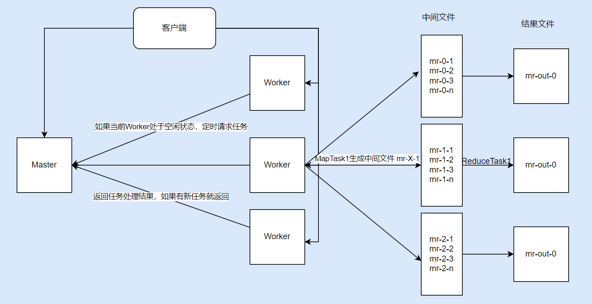
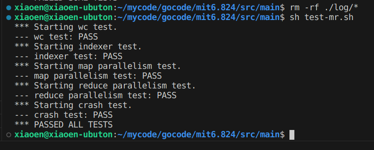

## 实验准备
+ MapReduce 论文: <http://nil.csail.mit.edu/6.824/2020/papers/mapreduce.pdf>
+ Lab1 要求: <http://nil.csail.mit.edu/6.824/2020/labs/lab-mr.html>

## 任务分析
需要在 `mr/master.go`、`mr/worker.go` 和 `mr/rpc.go` 中实现以下功能
+ Master 负责 Map/Reduce 任务的调度
  + Master 响应 Worker 的请求
  + 统计 Map/Reduce 任务的完成情况
  + 记录 Worker 状态，如果 Worker 下线或者处理任务的时间较长，需要将该 Worker 处理的任务交给其他 Worker 处理
+ Worker 负责处理 Map/Reduce 任务
  + 空闲时向 Master 请求任务，任务处理完成之后通知 Master
  + 如果 Worker 在规定的时间内没有完成任务，Master 需要将任务交给其他 Worker
+ Master 和 Worker 通过 RPC 通信
+ Map 任务需要将不同的 Key(文本中的单词) 映射到不同的文件中，文件的格式为 `mr-X-Y`, X 是映射编号，Y 是文本编号
+ Reduce 任务需要将映射编号为 X 的文件中的内容进行排序并保存到 `mr-out-X` 文件中
+ 在任务全部完成后，退出程序



## 设计实现
### Master 设计

```go
type Master struct {
	Workers      map[string]*WorkerInfo // Worker 信息
	MapTask      map[int64]*Task        // 保存所有的Map任务信息
	ReduceTask   map[int64]*Task        // 保存所有的Reduce任务信息
	TaskChan     chan Task              // 任务管道
	Status       int                    // Master 状态
	ComplMaps    int                    // 完成的 Map 任务
	ComplReduces int                    // 完成的 Reduce 任务
	NReduce      int
	lock         sync.Mutex
}

type Task struct {
	TaskId     int64    // 任务ID,时间戳
	TaskType   int      // 0: Map   1: Reduce
	TaskStatus int      // 0: 进行中  1：已完成  -1:未开始
	InputFile  []string // 输入文件
	OutputFile []string // 输出文件
	NReduce    int

	WorkerAddr string    // 处理该任务的 Worker 地址
	StartTime  time.Time // 开始处理时间
}

// Worker 获取任务 
func (m *Master) GetTaskOrSendWorkinfo(workerInfo WorkerInfo, reply *WorkerInfo) error{}

// Worker 返回处理结果
func (m *Master) ReturnTaskRes(workerInfo WorkerInfo, reply *WorkerInfo) error{}

// 监听 Master 状态
func (m *Master) listenTask(){}

func (m *Master) Done() bool{}

// ........
```
解释四个主要方法是需要完成的任务：
+ `GetTaskOrSendWorkinfo`: Master 需要存储 Worker 信息，来处理超时的情况， 因此 Worker 需要向 Master 请求任务，并定时发送 Worker 的状态信息。当Worker 处于空闲状态，Master 会分配 Map/Reduce 任务给 Worker，并更新 Worker 信息
+ `ReturnTaskRes`: 当 Worker 完成 Map/Reduce 任务，返回处理结果给 Master，如果当前 Master 还有任务，分配一个任务给改 Worker，减少一次网络请求
+ `listenTask`: 监听 Master 状态，如果正在处理 Map 任务，那么 Master 会遍历所有的 Map 任务，将 10s 内没有完成的任务交给其他空闲 Worker。
+ `Done`: 当所有任务都结束，结束程序

### Worker 设计
```go
// 处理 Map 任务
func processMapTask(worker *WorkerInfo, mapf func(string, string) []KeyValue){}

// 处理 Reduce 任务
func processReduceTask(worker *WorkerInfo, reducef func(string, []string) string) {}

// ..........
```
Worker 的设计比较简单，主要是上面两个函数，分别处理 Map 和 Reduce 任务

### RPC 设计
Master 和 Worker 通过 RPC 通信
```go
type TaskInfo struct {
	TaskId     int64    // 任务ID
	TaskType   int      // 0: Map   1: Reduce
	TaskStatus int      // 0: 进行中  1：已完成  -1:未开始
	InputFile  []string // 输入文件
	OutputFile []string // 输出文件
	NReduce    int
}

type WorkerInfo struct {
	WorkerAddr  string
	Status      int       // 0: 空闲 1：处理任务 -1: 结束 worker 进程
	TaskInfo    *TaskInfo // 处理的任务的信息
	LastReqTime time.Time // 上一次发送请求的时间
}
```

## 测试
执行测试脚本：`bash test-mr.sh`


## 总结
+ 刚开始调试时比较麻烦，因为开始时是使用 `fmt.Printf` 直接打印到控制台中，后面使用 `log` 输出到对应的日志文件中
+ 在设计 Master 时，由于对 `lock` 的使用不当，连续Lock多次，造成了死锁，调试的时候出现程序卡住，无法向下运行，对代码进行了梳理，调整了锁的使用和释放
+ 在进行 `crash test` 时，调试了较长时间，因为会随机退出正在执行的Worker线程，Master 需要重新分发该 Worker 的任务，在这个过程中忽略了某些状态的修改（重置），导致任务一直被重写分发，导致死锁