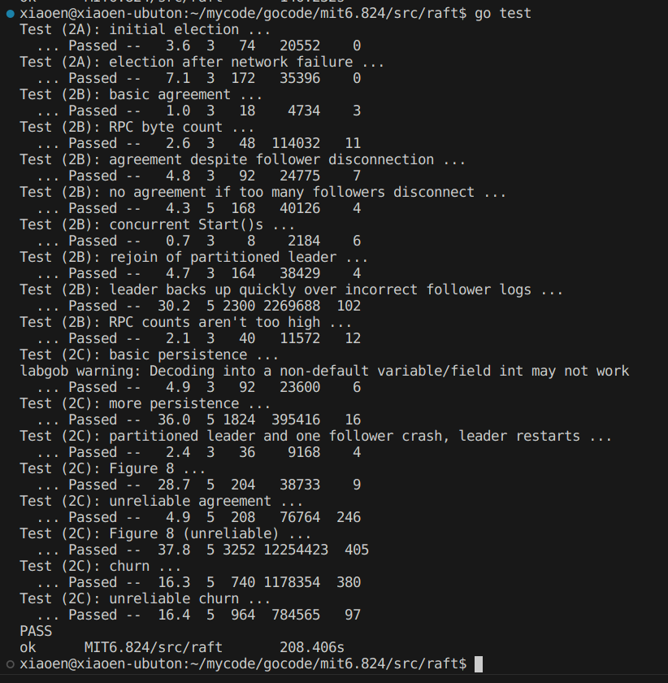

## 准备
+ 论文:
  + GFS: <http://nil.csail.mit.edu/6.824/2020/papers/gfs.pdf>
  + Fault-Tolerant VM: <http://nil.csail.mit.edu/6.824/2020/papers/vm-ft.pdf>
+ Lab2 要求: <http://nil.csail.mit.edu/6.824/2020/labs/lab-raft.html>

## 任务分析
Lab2 需要实现 Raft，包括领导者选举，日志复制，安全性以及持久化

Lab2 分成了3部分：
+ lab2A-领导者选举
  + 正常的选举，需要维护 Follower 的状态
  + Leader 崩溃后的正常运行，能够选出新的 Leader
+ lab2b-日志复制
  + 正常的复制
  + 在 Follower 崩溃后，再重新上线，需要同步 Leader 的日志
  + 在 Leader 崩溃后，新Leader 能够正常运行，并且如果旧Leader 重新上线后，需要同步新Leader的日志
  + 需要处理 Leader 和 Follower 之间日志的不一致
+ lab3b-持久化
  + 服务器重启能够从原位置恢复服务，需要考虑持久化时机以及持久化的数据

## 设计实现
安装 Raft 论文的描述来设计 AppendEntries RPC 和 Vote RPC
```go
type RequestVoteArgs struct {
  Term         int // 当前任期号
  CandidateId  int // 当前Candidate的ID
  LastLogIndex int // 当前最后一个日志条目的索引
  LastLogTerm  int // 当前最后一个日志条目的任期
}

type RequestVoteReply struct {
  Term        int  // 当前任期号
  VoteGranted bool // 是否投票
}

type AppendEntriesRequest struct {
  Term         int        // 当前任期号
  LaderId      int        // 当前Leader的ID
  PervLogIndex int        // Follower前一个日志的索引
  PrevLogTerm  int        // Follower前一个日志的任期
  Log          []LogEntry // 日志条目
  LeaderCommit int        // Leader 已经提交的日志索引
}

type AppendEntriesResponse struct {
  Term    int  // 当前任期号
  Success bool // 是否复制成功
  XTerm   int  // 发生冲突的日志任期
  XIndex  int  // 发生冲突的日志索引
}
```

Raft 结构
```go
type Raft struct {

}
```


## 测试
运行测试程序：`go test -run 2A`，`go test -run 2B`，`go test -run 2C`，`go test`





> Test (2B): leader backs up quickly over incorrect follower logs
超过半数跟随者宕机，领导人在期间接收很多日志(应该丢弃的)， 然后宕机，原来宕机的跟随者
恢复，并且新领导人接收很多日志，然后新领导人宕机，宕机后接收很多日志
在这个情况下测试是否日志正确(未提交的日志会被覆盖)
TestBackUp：
1. 启动五个节点，进行选举，选举结果为一个Leader 和 4个 follower
2. 选举完成后，client 发送一条 日志，Leader 通过 AppendEntries RPC 发送给其他 follower
3. client 接着发送 50 条日志，这时候会下线3个follower，此时系统中有1个Leader和1个follower

## 总结