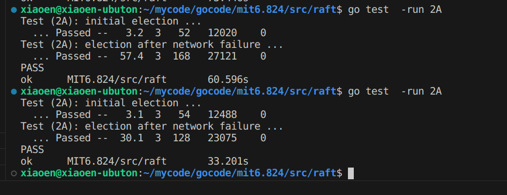
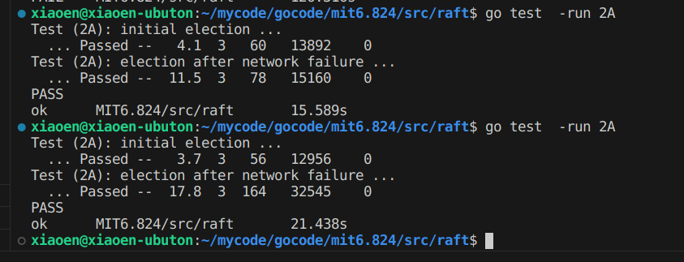

## 准备
+ 论文:
  + GFS: <http://nil.csail.mit.edu/6.824/2020/papers/gfs.pdf>
  + Fault-Tolerant VM: <http://nil.csail.mit.edu/6.824/2020/papers/vm-ft.pdf>
+ Lab2 要求: <http://nil.csail.mit.edu/6.824/2020/labs/lab-raft.html>

## Lab2A
### 任务分析
需要实现 Raft 的领导选举和心跳机制

启动Raft后会检查当前系统是否有leader，如果没有则会修改当前节点状态，发起竞选

运行测试文件：`go test -run 2A`

### 设计实现

### 测试
`go test -run 2A`

### 总结