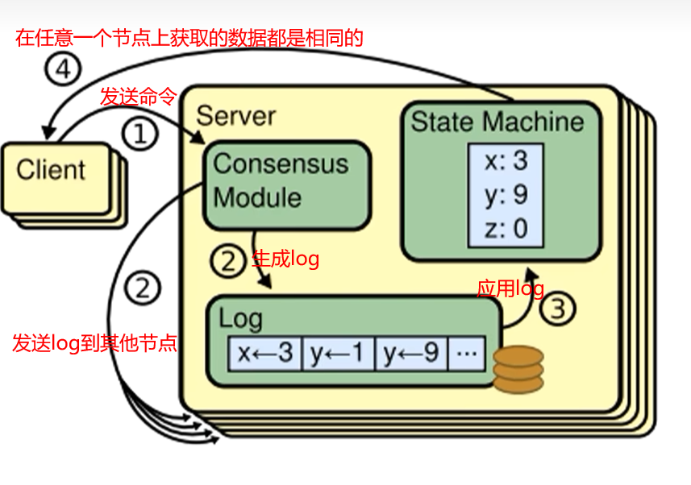
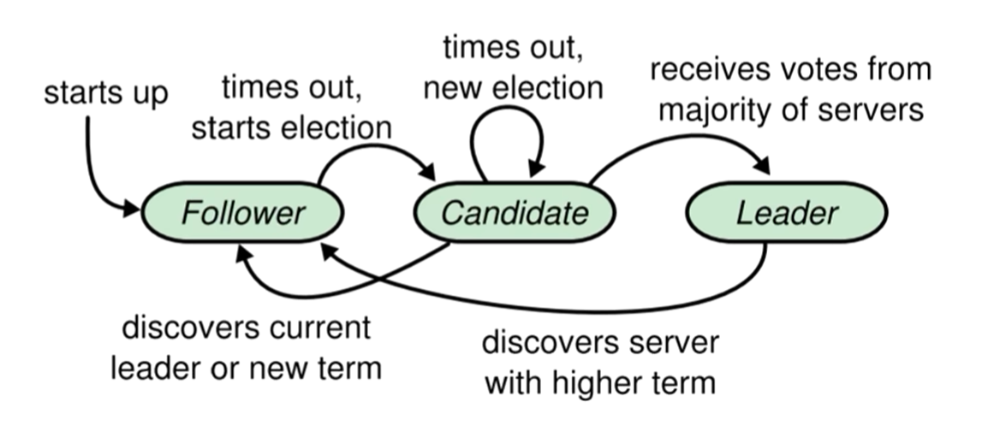
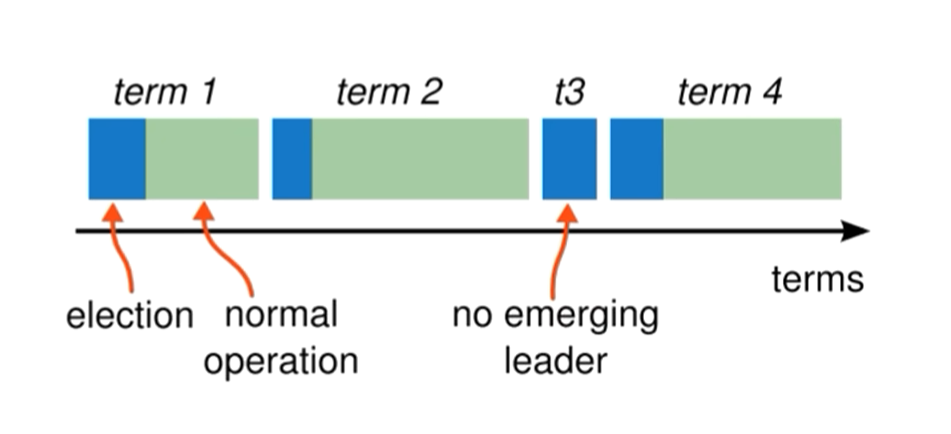
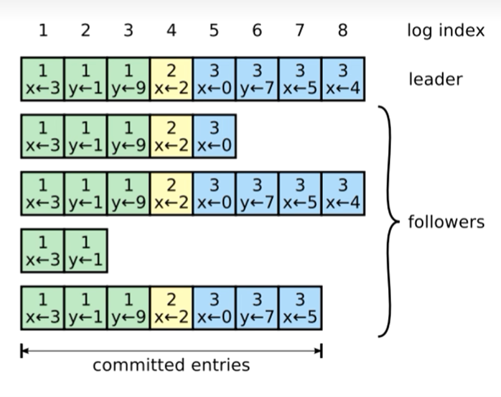

http://nil.csail.mit.edu/6.824/2020/papers/raft-extended.pdf


## 复制状态机
核心思想：**相同的初始状态 + 相同的输入 = 相同的结束状态**

在多个节点上，从相同的初始状态开始，执行相同的一串命令，产生相同的最终状态



在 Raft 中，leader 将客户端请求（command）f封装到一个个log entry 中，将这些 log entries 复制到所有 follower 节点，然后大家按照相同的顺序应用 log entries 中的 command，根据复制状态机的理论，大家的结束状态肯定是一致的。

## 状态简化



在任何时刻，每个服务器节点都处于 follower，candidate，leader 三种状态之一。

任何一个节点启动时会将自己设置为 follower 状态，当察觉到当前集群中没有 leader，会将自己的状态切换到 candidate 状态，在 candidate 中经历一次或多次选举后，更加选举的结果决定自己切换到 leader 还是 follower 状态。



Raft 把时间分割成任意长度的任期(term)，任期用连续的整数标记。

每一段任期从一次选举开始。在某些情况下，一次选举无法选出 leader (比如两个节点收到了相同的票数)， 在这种情况下，这一任期会以没有 leader 结束; 一个新的任期(包含一次新的选举)会很快重新开始。Raft 保证在任意一个任期内， 最多只有一个 leader。

Raft 中的节点使用 RPC 进行通信，主要有两种 RPC:
+ `RequestVote RPC`：请求投票，由 candidate 在选举期间发起
+ `AppendEntries RPC`：追加条目，由 leader 发起，用来复制日志和提供一种心跳机制

## 领导者选举
Raft 内部有一种心跳机制，如果存在 leader，那么它就会周期性地向所有 follower 发送心跳，来维持自己的地位。如果 follower 一段时间没有收到心跳，那么它就会认为系统中没有可用的 leader，然后开始选举。

```go
// 请求投票 RPC Request
type RequestVoteRequets struct {
    term         int // 自己当前的任期号
    candidateId  int // 自己的ID
    lastLogIndex int // 自己最后一个日志号
    lastLogTerm  int // 自己最后一个日志的任期
}

// 请求投票 RPC Response
type RequestVoteResponse struct {
    term        int  // 自己当前任期号
    voteGranted bool // 自己会不会投票给这个 candidate
}
```
1. 开始一个选举过程后，follower 先增加自己的当前任期号，并转换到 candidate 状态，然后投票给自己，并且并行的向集群中的其他服务器节点发送投票请求
2. 每个节点只有一次投票机会，按照先来先得的原则进行投票
3. 投票结果：
   + 它获得**超过半数的选票**赢得选举，成为 leader并开始发送心跳
   + 其他节点赢得选举，在收到**新leader的心跳**后，如果新leader的任期号不小于自己的当前任期号，那么就从 candidate 转换到 follower 状态
   + 一段时间后没有任何获胜者，每个 candidate 都在一个自己的随机选举超时时间后增加任期号，并开始新一轮投票
       + 在有多个 follower 同时成为 candidate 时，有可能存在得票太过分散的情况，会发生没有任何一个 candidate 得票数超过半数的结果

## 日志复制

在 leader 被选举出来之后，开始为客户端请求提供服务

1. leader 接收到客户端指令后，会把指令作为一个新的条目追加到**日志**中。一个日志中需要具有三个信息
   + 状态机指令
   + leader 的任期号
   + 日志索引
2. leader 并行的发送 AppendEntries RPC 给 followers，让它们复制该条目。当该条目被超半数的 follower 复制后，leader 就可以在本地执行该指令并把结果返回客户端



在此过程中，leader 或 follower随时都有崩溃或缓慢的可能性，Raft必须要在有宕机的情况下继续支持日志复制，并且保证每个副本日志顺序的一致(以保证复制状态机的实现)。具体有三种可能:
1. 如果有 follower 因为某些原因没有给 leader 响应，那么 leader 会不断地重发追加条目请求(AppendEntries RPC)，哪怕 leader 已经回复 了客户端
2. 如果有 follower 崩溃后恢复，这时 Raft 追加条目的**一致性检查**生效，保证 follower 能按顺序恢复崩溃后的缺失的日志
   + Raft 的一致性检查: leader 在每一个发往 follower 的追加条目RPC中，会放入前一个日志条目的索引位置和任期号，如果 follower 在它的日志中找不到前一个日志，那么它就会拒绝此日志，leader 收到 follower 的拒绝后，会发送前一个日志条目，从而逐渐向前定位到follower第一个缺失的日志
3. 如果 leader 崩溃，那么崩溃的 leader 可能已经复制了日志到部分follower但还没有提交，而被选出的新leader 又可能不具备这些日志，这样有部分 follower 中的日志和新leader中的日志不相同
   + Raft 在这种情况下，leader 通过**强制 follower 复制它的日志**来解决不一致问题，这意味着 follower 中跟 leader 冲突的日志条目会被新leader的日志条目覆盖（因为没有提交，所以不违背外部一致性）

```go
// 追加日志 RPC Request
type AppendEntriesRequest struct {
    term         int    // 自己当前的任期号
    laderId      int    // 自己的ID
    prevLogIndex int    // 前一个日志的日志号
    prevLogTerm  int    // 前一个日志的任期号
    entires      []byte // 当前日志体
    leaderCommit int    // leader 已提交的日志号
}

// 追加日志 RPC Response
type AppendEntriesResponse struct {
    term    int  // 自己当前的任期号
    success bool // 如果 follower 包括前一个日志，则返回 true
}
```
follower 在接收到追加条目RPC后，如果发现 leaderCommit > commitIndex，那么把自己的 commitIndex 设置为 min(leaderCommit, index of last new entry)

### no-op
no-operation: 当一个节点当选 leader 后，立刻发送一个自己当前任期的空日志体的 AppendEntries RPC，这样可以把之前任期内满足提交条件的日志都提交了

一旦 no-op 完成复制，就可以把之前任期内符合提交条件的日志保护起来了，从而就可以使它们安全提交。

## 安全性
Raft 为了保证每一个状态机会按照相同的顺序执行相同的命令，补充了几个规则完善整个算法

### Leader 选举限制
如果一个 follower 落后了 leader 的若干条日志（但没有遗漏一整个任期），那么下次选举中该 follower 有可能当选 leader。在它当选新leader后就永远无法补上之前缺失的那部分日志，从而造成状态机之间的不一致。

所以需要对领导者选举增加一个限制：保证被选出来的leader一定包含了之前各个任期的所有**被提交的日志条目**

在 Raft 的 RequestVote RPC 执行了这样的限制：
+ RPC 中包含了 Candidate 的日志信息，如果投票者自己的日志比 Candidate 的还新，它会拒接该投票请求
  + Raft 通过比较两份日志中的最后一条日志条目的索引值和任期号来定义谁的日志比较新
  + 如果两份日志最后条目的任期号不同，那么任期号大的日志更**新**
  + 如果两份日志最后条目的任期号相同，那么日志索引值更大的日志更**新**


### Leader 宕机处理
关于日志提交（应用到状态机中）：
+ leader 日志提交： 一旦当前任期内的某个日志条目已经存储到过半的服务器节点上，leader 就知道该日志可以被提交了
+ follower 日志提交：通过下一个 AppendEntries RPC 中的 leaderCommit 来判断是否提交

如果某个 leader 在提交某个日志条目之前崩溃了，以后的 leader 会试图完成该日志条目的复制（而非提交）

raft 不会通过计算副本数目的方式来提交**之前任期内的日志条目**，只有 leader **当前任期内的日志条目**才通过计算副本数目的方式来提交。一旦当前任期内的某个日志条目以这种方式被提交，那么由于日志匹配特性，之前的所有日志条目都会被间接地提交


### Follower 和 Candidate 宕机处理
如果 Follower 和 Candidate 崩溃了，那么后继发送给它们的 RequestVote 和 AppendEntries RPC 都会失败。

Raft 通过**无限的重试**来处理这种失败。如果崩溃的机器重启了，那么这些RPCj就会成功地完成

如果一个服务器在完成了一个 RPC，但是还没有响应的时候崩溃了，那么它重启之后就会收到同样的请求

### 时间和可用性限制
raft 算法整体不依赖客观时间，哪怕因为网络因素或者其他因素，造成后发的RPC先到，也不会影响 raft 的正确性

只要整个系统满足以下的时间要求，raft 就可以选举出并维持一个稳定的 leader:

**广播时间 << 选举超时时间 << 平均故障时间**

广播时间和平均故障时间是有系统决定的，选举超时时间是由我们自己选择的。raft 的 RPC 需要接收并将信息落盘，所以广播时间大约是0.5ms到20ms，取决于存储技术。因此，选举超时时间可能需要在 10~500ms 之间。大多数服务器的平均故障时间间隔时间都在几个月甚至更长

## 集群成员变更

## 总结
