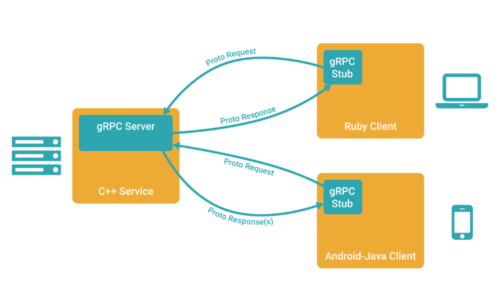

## 介绍
+ 官方文档：https://grpc.io/
+ 中文文档：https://doc.oschina.net/grpc

RPC，Remote Procedure Call，远程过程调用，一种通信协议，屏蔽分布式计算中的各种调用细节，可以像本地调用一样直接调用一个远程函数

gRPC，一个高性能，开源的 RPC 框架，使用 Protocol Buffers 作为数据结构序列化机制（序列化和反序列化性能比 JSON 和 XML 要好，且体积很小，适合网络传输）

## 准备
+ 安装 protoc
+ 安装 gRPC 核心库
+ 安装 代码生产工具

## proto 文件
https://juejin.cn/post/6978474549025177608

## 代码生产

生成代码：`protoc --go_out=. --go-grpc_out=. ./hello.proto`
+ `--go_out=.` 表示 xx.pb.go 文件生成在当前目录下
+ `--go-grpc_out=.` 表示 xx_grpc.pb.go 文件生产在当前目录下
+ `./hell.proto` 表示通过当前目录下的 proto 文件生成对应的代码

