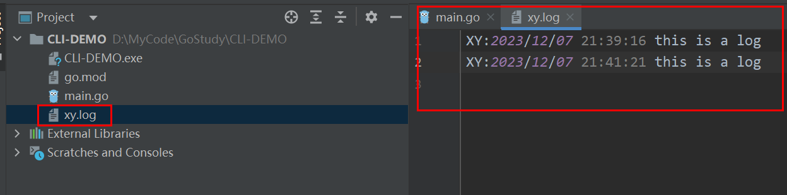
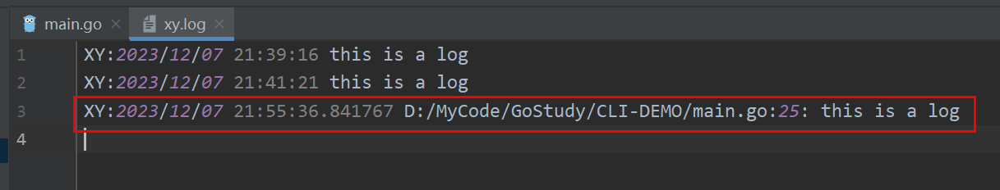

## 打印日志
+ `log.Println("log message")`
+ `log.Fatalln("log message")`
+ `log.Panicln("log message")`
```go
package main

import (
	"fmt"
	"log"
)

// init() 函数会在 main() 函数之前执行
func init() {
	fmt.Println("init func execute")
}

func main() {

	log.Println("this is a log") // 打印日志后会继续执行
	/**
	init func execute
	2023/12/07 21:27:39 this is a log
	*/

	log.Fatalln("this is a log") // 打印日志后会执行 os.Exit(1)， 结束程序
	/**
	init func execute
	2023/12/07 21:27:17 this is a log

	Process finished with the exit code 1
	*/

	log.Panicln("this ia a log") // 打印日志后，并打印 stackTrace
	/**
	init func execute
	2023/12/07 21:26:07 this ia a log
	panic: this ia a log


	goroutine 1 [running]:
	log.Panicln({0xc00011bf60?, 0x0?, 0x0?})
	        D:/Dev/Go/src/log/log.go:399 +0x65
	main.main()
	        D:/MyCode/GoStudy/CLI-DEMO/main.go:18 +0x45

	Process finished with the exit code 2
	*/
}
```

## 相关设置
### 设置日志前缀
```go
package main

import (
	"log"
)

func init() {
	// 设置日志前缀
	log.SetPrefix("XY:")

}

func main() {

	log.Println("this is a log") // XY:2023/12/07 21:31:30 this is a log

}
```

### 设置日志保存文件

```go
package main

import (
	"log"
	"os"
)

func init() {
	// 设置日志前缀
	log.SetPrefix("XY:")

	// 设置保存文件
	f, err := os.OpenFile("./xy.log", os.O_CREATE|os.O_APPEND|os.O_WRONLY, 0666)
	if err != nil {
		log.Fatalln(err)
	}
	log.SetOutput(f)
}

func main() {

	log.Println("this is a log")

}
```
多出xy.log文件，并且日志内容背写入该文件中




> 在 Go 语言中，文件权限由一个八进制数表示，通常使用四个数字来表示权限的不同组合。
> 每个数字代表一组权限，从左到右分别是：
> + 第一个数字表示所有者（文件的拥有者）的权限
> + 第二个数字表示与所有者同一组的用户的权限
> + 第三个数字表示其他用户的权限
> 
> 每个数字可以取以下数值的组合：
> + 0：没有权限（无法读取、写入或执行）
> + 1：执行权限
> + 2：写入权限
> + 3：写入和执行权限
> + 4：读取权限
> + 5：读取和执行权限
> + 6：读取和写入权限
> + 7：读取、写入和执行权限

### 设置打印格式
```go
package main

import (
	"log"
	"os"
)

func init() {
	// 设置日志前缀
	log.SetPrefix("XY:")

	// 设置保存文件
	f, err := os.OpenFile("./xy.log", os.O_CREATE|os.O_APPEND|os.O_WRONLY, 0666)
	if err != nil {
		log.Fatalln(err)
	}
	log.SetOutput(f)

	// 设置输出格式，默认是时间+日期: Ldate | Ltime，也可以自行修改
	log.SetFlags(log.Ldate | log.Ltime | log.Lmicroseconds | log.Llongfile)
}

func main() {

	log.Println("this is a log")

}
```


## 自定义 logger
```go
package main

import (
	"io"
	"io/ioutil"
	"log"
	"os"
)

var (
	Trace   *log.Logger // 几乎任何东西
	Info    *log.Logger // 重要信息
	Warning *log.Logger // 警告
	Error   *log.Logger // 错误
)

func init() {
	file, err := os.OpenFile("./errors.log", os.O_CREATE|os.O_WRONLY|os.O_APPEND, 0666)
	if err != nil {
		log.Fatalln("无法打开错误 log 文件:", err)
	}

	Trace = log.New(ioutil.Discard, "TRACE: ", log.Ldate|log.Ltime|log.Lshortfile)
	Info = log.New(os.Stdout, "INFO: ", log.Ldate|log.Ltime|log.Lshortfile)
	Warning = log.New(os.Stdout, "WARNING: ", log.Ldate|log.Ltime|log.Lshortfile)
	Error = log.New(io.MultiWriter(file, os.Stderr), "ERROR: ", log.Ldate|log.Ltime|log.Lshortfile)

}

func main() {
	Trace.Println("鸡毛蒜皮的小事")
	Info.Println("一些特别的信息")
	Warning.Println("这是一个警告")
	Error.Println("出现了故障")
}
```
输出结果
```text
控制台：
INFO: 2023/12/07 22:09:46 main.go:32: 一些特别的信息
WARNING: 2023/12/07 22:09:46 main.go:33: 这是一个警告
ERROR: 2023/12/07 22:09:46 main.go:34: 出现了故障


errors.log 文件
ERROR: 2023/12/07 22:09:46 main.go:34: 出现了故障
```