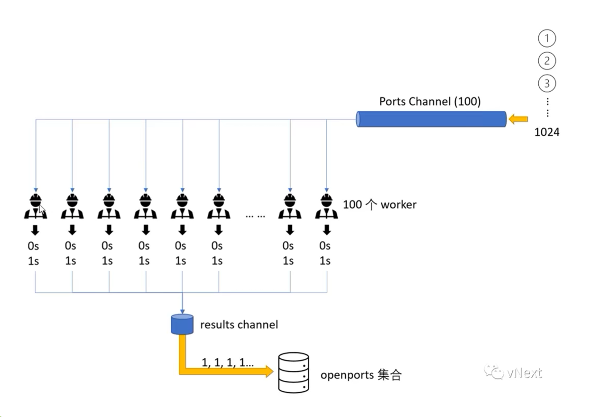

扫描1~1024的端口的耗时
+ 非并发版: 2071 seconds
+ 并发版: 2094 ms
+ goroutine 池并发版: 22299 ms

## 非并发版
```go
func main() {
	// 扫描1~1024的端口号
	start := time.Now()
	for i := 1; i < 1025; i++ {
		address := fmt.Sprintf("127.0.0.1:%d", i)
		conn, err := net.Dial("tcp", address)
		if err != nil {
			fmt.Println(address, "关闭了！")
			continue
		}
		conn.Close()
		fmt.Println(address, "打开了！")
	}
	elapsed := time.Since(start) / 1e9
	fmt.Printf("\n%d seconds", elapsed) // 2071 seconds
}
```
## 并发版
```go
package main

import (
	"fmt"
	"net"
	"sync"
	"time"
)

func main() {
	// 扫描1~1024的端口号
	start := time.Now()

	var wg sync.WaitGroup
	for i := 1; i < 1024; i++ {
		wg.Add(1)
		go func(j int) {
			defer wg.Done()
			address := fmt.Sprintf("127.0.0.1:%d", j)
			conn, err := net.Dial("tcp", address)
			if err != nil {
				fmt.Println(address, "关闭了！")
				return
			}
			conn.Close()
			fmt.Println(address, "打开了！")
		}(i)
	}
	wg.Wait()

	elapsed := time.Since(start) / 1e6
	fmt.Printf("\n %d ms", elapsed) // 2094 ms
}
```
## goroutine 池并发版
创建一个chan，大小为100，用来扫描端口，再用一个chan来接收扫描的结果



```go
package main

import (
	"fmt"
	"net"
	"sort"
	"time"
)

func worker(ports chan int, result chan int) {
	for p := range ports {
		address := fmt.Sprintf("127.0.0.1:%d", p)
		conn, err := net.Dial("tcp", address)
		if err != nil {
			result <- -p
			continue
		}
		conn.Close()
		result <- p
	}
}

func main() {
	start := time.Now()
	ports := make(chan int, 100)
	results := make(chan int)
	var openports []int
	var closeports []int

	for i := 0; i < cap(ports); i++ {
		go worker(ports, results)
	}

	// 防止阻塞，应为接收的results chan大小为1
	go func() {
		for i := 1; i < 1025; i++ {
			ports <- i
		}
	}()

	for i := 1; i < 1025; i++ {
		port := <-results
		if port > 0 {
			openports = append(openports, port)
		} else {
			closeports = append(closeports, -port)
		}
	}

	close(ports)
	elapsed := time.Since(start) / 1e6
	fmt.Printf("\n %d seconds", elapsed) //

	sort.Ints(openports)
	sort.Ints(closeports)
	for _, port := range openports {
		fmt.Println("127.0.0.1:", port, "打开了！")
	}
	for _, port := range closeports {
		fmt.Println("127.0.0.1:", port, "关闭了！")
	}
}
```