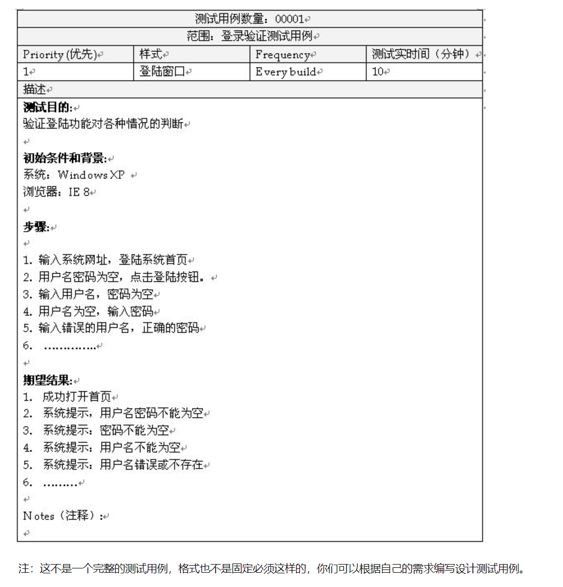

## 软件测试

### 定义

软件 = 文档 + 程序 + 数据

软件测试就是一个过程或者一系列过程，用来确保程序完成了其应该完成的功能，并且不会执行不该执行的操作。软件应该是可以预测且稳定的，不会给用户带来意外的情况。

### 对象

软件测试 != 程序测试，软件测试贯穿于软件定义和开发的整个期间。需求分析，概要设计，详细设计以及程序编码等各个阶段所得到的文档（需求规格说明，概要设计规格说明，详细设计规格说明以及源程序）都是软件测试的对象

## 软件测试的分类

+ 按开发阶段分类：单元测试，集成测试，系统测试，验收测试
+ 按测试组织分类：开发方测试，用户测试，第三方测试
+ 按测试技术分类：白盒测试，黑盒测试，灰盒测试

## 软件测试流程

1. 根据需求设计测试计划
2. 设计并编写测试用例
3. 执行测试用例，提交缺陷报告
4. 提交测试总结报告

## 测试用例

测试用例是为某个特殊目标而编制的一组测试输入，执行条件以及预期结果，用于核实是否满足某个特定软件需求

好处:
+ 理清思路，避免遗漏
+ 跟踪测试进展
+ 历史参考
+ 重复使用

### 测试用例的编写

+ 等价类划分：将输入集合划分为两个子集合：有效等价类和无效等价类。有效等价类就是有效的输入，无效等价类就是无效的输入
+ 边界值划分：对等价类的补充，因为有很多错误都是出现在输入输出的边界上。找出等价类的边界点，对边界数据进行测试
+ 因果图：根据输入条件的各种组合条件，生成判定表
+ 错误推测法：基于经验和直觉推测出系统可能存在的错误，从而有针对性的设计测试用例的方法

例子：假如有一个输入框要求输入1-10000个数。

等价类划分：有效等价类和无效等价类，输入框要求输入1-10000的数
+ 有效等价类：可以输入1-10000之间的数来验证，如：2、5、99、8495......
+ 无效等价类：可以输入1-10000之外的任意字符验证，如：20000、字母、下划线、特殊符号、空格、回车.....

边界值划分：0、-1、-2、1000、10001.....

### 测试用例的格式

一个测试用例应该包括：编号，标题，测试场景，测试步骤，预期结果，其他（优先级，测试阶段等）

## Bug的处理
