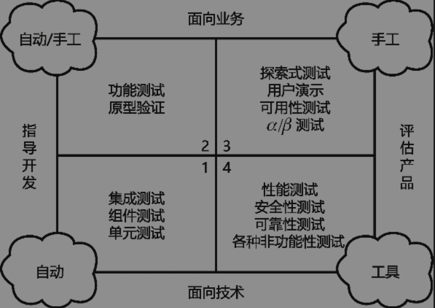

## 介绍
Selenium官网：<https://www.selenium.dev/>

什么是自动化测试？

软件测试一般是由测试人员手动执行，如果由机器代替测试人员来执行软件测试，这种测试就是自动化测试

什么场景适合自动化测试？



+ 第一象限：面向技术和指导开发，该象限中的测试主要为集成测试、组件测试、单元测试等，让开发团队能够获得代码级别的高效反馈，从技术上而言可以实现完全自动化。
+ 第二象限：面向业务和指导开发，该象限中的测试主要为功能性的验证测试，判断开发团队的产出是否符合需求，从技术上而言大部分可以实现自动化。但越面向业务，实现成本越高，是否自动化一般取决于成本因素。
+ 第三象限：面向业务和评估产品，该象限中的测试（例如探索式测试、可用性测试，等等）需要靠测试人员主动探索系统潜在的故障，而其他类型的测试偏重客户（而非测试人员）在使用过程中的使用体验，所以以手工测试为主。
+ 第四象限：面向技术和评估产品，该象限中的测试主要为非功能性测试，例如性能测试、安全性测试、可靠性测试等。这些测试的场景复用度不高，而且一般依赖于特定的测试工具，能否自动化取决于场景是否有复用价值及工具本身是否能有效支持自动化。

第一象限中的测试类型全都可以自动化，包括单元测试、组件测试等。第二象限中的测试类型大部分可以自动化，例如功能验收测试。第四象限中的测试类型受工具的限制，且测试场景具有一定局限性，所以只有小部分可以做成可复用的自动化测试，而第三象限的测试通常只能以手工方式进行

Selenium 是什么？
Selenium本质上是由多种工具组合在一起的测试工具集合，包含以下几种：
+ Selenium IDE：是Chrome和Firefox的扩展工具，用于在浏览器中进行便捷的录制与回放测试的操作
+ Selenium WebDriver：可以在**本地或远程计算机**上以原生方式驱动浏览器，就好像用户在真实操作浏览器一样
+ Selenium Grid：支持在**多台机器上同时运行**多个基于WebDvrier的测试，减少在多浏览器和多操作系统上测试耗费的时间
+ Appium：是基于WebDriver标准的开源工具，主要用于移动设备原生App及Web应用程序的自动化测试


## 安装

1. 下载驱动：要使用 Selenium 需要下载对应浏览器的驱动
   + Chrome驱动下载地址：<https://chromedriver.chromium.org/downloads>
2. Selenium IDE: 可以在 Chrome 扩展商店下载，收缩`Selenium IDE`即可

## 使用

创建项目，并导入依赖

```xml
    <dependencies>
        <!--selenium依赖-->
        <dependency>
            <groupId>org.seleniumhq.selenium</groupId>
            <artifactId>selenium-java</artifactId>
            <version>4.18.1</version>
        </dependency>
        <!--junit5测试-->
        <dependency>
            <groupId>org.junit.jupiter</groupId>
            <artifactId>junit-jupiter-api</artifactId>
            <version>5.3.1</version>
        </dependency>
    </dependencies>
```

使用
```java
    @Test
    public void testStart() {
        // 1.创建驱动
        WebDriver driver = new ChromeDriver();
        // 2.获取百度首页信息
        driver.get("https://www.baidu.com/");
        // 3.根据id获取输入框，并填入数据
        driver.findElement(By.id("kw")).sendKeys("selenium");
        // 4.根据id获取搜索按钮，执行点击事件
        driver.findElement(By.id("su")).click();
        Thread.sleep(10000);
        // 5.退出浏览器
        driver.quit();
    }
```