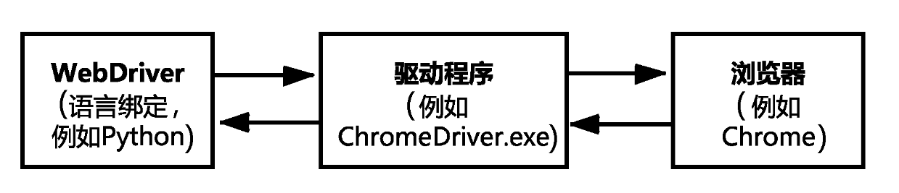
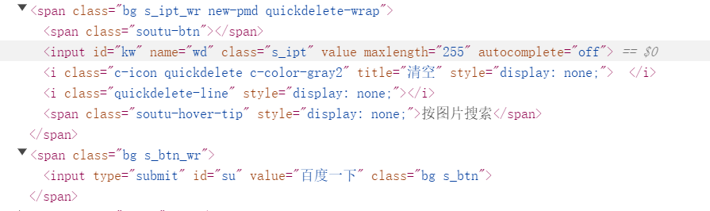

https://www.cnblogs.com/tester-ggf/p/12602211.html
## 介绍

Selenium通过WebDriver，WebDriver是一种API和协议，它定义了一种不依赖与编程语言，用于控制Web浏览器行为的接口，每种浏览器会提供实现WebDriver接口的驱动程序（一般是.exe文件）



## 浏览器导航操作
1. 获取Navigation对象: `WebDriver.Navigation navigation =  webDriver.navigate();`
2. 使用Navigation对象方法
   1. `navigation.back()`：浏览器回退
   2. `navigation.forward()`：浏览器前进
   3. `navigation.refresh()`：浏览器刷新
   4. `navigation.to("url")`：浏览器跳转

```java
    @Test
    public void testNavigate() throws InterruptedException {
        ChromeDriver webDriver = new ChromeDriver();
        webDriver.get("https://www.baidu.com"); // 打开

        WebDriver.Navigation navigation =  webDriver.navigate();
        Thread.sleep(1000);

        navigation.back();    // 回退
        Thread.sleep(1000);

        navigation.forward(); // 前进
        Thread.sleep(1000);

        navigation.refresh(); // 刷新
        Thread.sleep(1000);

        navigation.to("https://www.bilibili.com/"); // 跳转
        Thread.sleep(1000);

        webDriver.quit();
    }
```

## 浏览器窗口操作
1. 获取Window对象：`WebDriver.Window window = webDriver.manage().window();`
2. 使用Window对象方法
   1. `window.maximize()`：窗口最大化
   2. `window.minimize()`：窗口最小化
   3. `window.fullscreen()`：全屏
   4. `window.setSize(new Dimension(width, height))`：设置窗口的大小
   5. `window.setPosition(new Point(x, y))`：设置浏览器窗口的位置（左上角）
   6. `window.getPosition()`：获取窗口位置

```java
    @Test
    public void testWindow() throws InterruptedException {
        ChromeDriver webDriver = new ChromeDriver();
        webDriver.get("https://www.baidu.com"); // 打开

        WebDriver.Window window = webDriver.manage().window();

        window.maximize(); // 窗口最大化
        Thread.sleep(1000);

        window.minimize(); // 窗口最小化
        Thread.sleep(1000);

        window.fullscreen(); // 全屏
        Thread.sleep(1000);

        window.setSize(new Dimension(200, 500)); // 设置窗口的大小
        window.setPosition(new Point(100, 100)); // 设置浏览器窗口的位置（左上角）
        Thread.sleep(1000);

        webDriver.quit();
    }
```

## 查找页面元素

Selenium提供了8种定位元素的方法
+ by id：`findElement(By.id())`
+ by name：`findElement(By.name())`
+ by class：`findElement(By.className())`
+ by tag type：`findElement(By.tagName())`
+ by link：`findElement(By.linkText())`
+ by part link：`findElement(By.partialLinkText())`
+ by xpath：`findElement(By.xpath())`
+ by css selector：`findElement(By.cssSelector())`

以百度页面的搜索框和搜索按钮为例，下面是的页面的HTML代码


```java
    @Test
    public void testSearchById() {
        WebDriver webDriver = new ChromeDriver();
        webDriver.get("https://www.baidu.com");

        // 获取搜索按钮的文本值
        WebElement submitButton =  webDriver.findElement(By.id("su"));
        submitButton.getAttribute("text");
        System.out.println("按钮的文本值是：" + submitButton.getAttribute("value")); // 按钮的文本值是：百度一下

        webDriver.quit();
    }

    @Test
    public void testSearchByName() throws InterruptedException {
        WebDriver webDriver = new ChromeDriver();
        webDriver.get("https://www.baidu.com");

        WebElement searchInput =  webDriver.findElement(By.name("wd"));
        searchInput.sendKeys("搜索值");
        System.out.println("搜索框的文本值是：" + searchInput.getAttribute("value")); // 搜索框的文本值是：搜索值
        
        Thread.sleep(3000);
        webDriver.quit();
    }

    @Test
    public void testSearchByClass() {
        WebDriver webDriver = new ChromeDriver();
        webDriver.get("https://www.baidu.com");

        WebElement submitButton =  webDriver.findElement(By.className("s_btn"));
        submitButton.getAttribute("text");
        System.out.println("按钮的文本值是：" + submitButton.getAttribute("value"));

        webDriver.quit();
    }
```


### xpath定位

路径定位
+ 以 `/` 开始表示到一个元素的绝对路径
+ 以 `//` 开始表示到一个元素的相对路径

索引定位

轴定位

## 操作页面元素

## Selenium API

### WebDriver API

### WebElement API

## 等待机制

## 特殊元素操作

### 弹出框处理


### iframe

