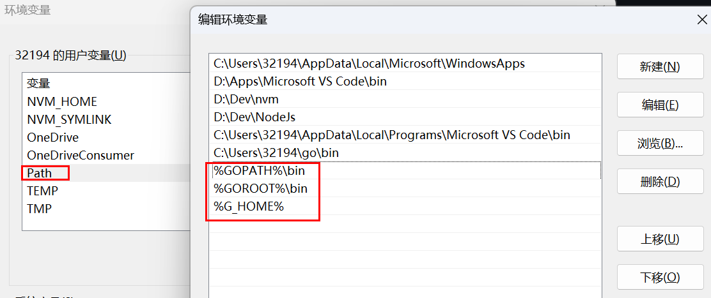
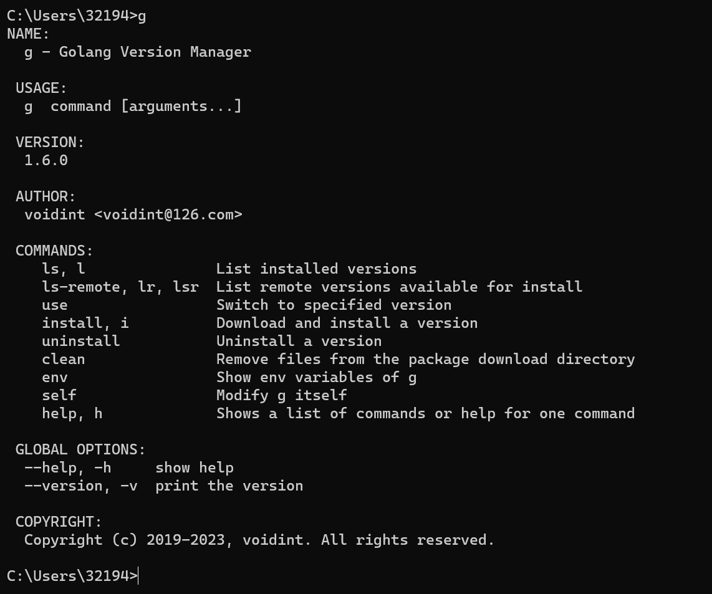

## 下载
下载地址：https://github.com/voidint/g/releases

## 环境变量配置


+ `G_HOME`: g 工作空间，刚刚下载的文件所在的目录
+ `G_MIRROR`: 下载镜像地址
+ `GOPATH`: 你 go 代码存放的文件夹
+ `GOROOT`: `%G_HOME%\go`，使用 g 下载 go 的时候，会放到这个文件夹中
+ `G_EXPERIMENTAL`: g 默认将下载的 go 放在系统盘下，如果你想自定义 go 的使用目录，则需要在 release 中下载 1.2.1 以后的版本

将 `G_HOME`，`GOPATH`，`GOROOT` 放入 `Path` 中



## 验证
cmd 打开命令行窗口，输入 g，出现以下界面，说明安装成功



## 操作
+ `g ls-remote`：查看远程所有的 go 版本
  ```shell
  C:\Users\32194>g ls-remote
  1
  1.2.2
  1.3rc1
  1.3rc2
  1.3
  1.3.1
  1.3.2
  1.3.3
  1.4beta1
  1.4rc1
  1.4rc2
  1.4
  1.4.1
  1.4.2
  1.4.3
  ......
  ```
+ `g install xxx.xxx`：下载 go 指定版本
  ```shell
  C:\Users\32194>g install 1.8
  Downloading 100% [===============] (96/96 MB, 1.5 MB/s)
  Computing checksum with SHA256
  Checksums matched
  Now using go1.8
  ```
+ `g ls`：查看本地所有的 go 版本
  ```shell
  C:\Users\32194>g ls
  * 1.8
    1.20
  ```
+ `g use xxx.xxx`：切换到指定 go 版本
  ```shell
  C:\Users\32194>g use 1.20
  go version go1.20 windows/amd64
  ```
+ `g uninstall xxx.xxx`：删除指定版本
  ```shell
  C:\Users\32194>g uninstall 1.8
  Uninstalled go1.14.7
  ```
