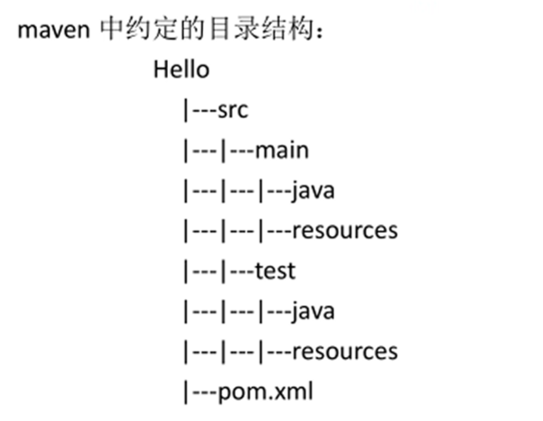
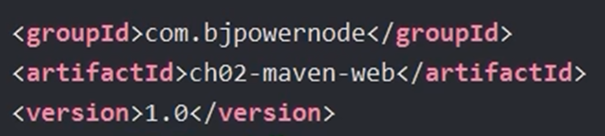
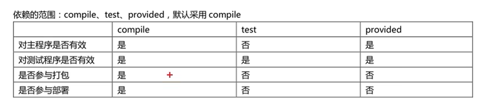

## 介绍

官网：[https://maven.apache.org/]([https://maven.apache.org/]())

中央仓库：[https://repo.maven.apache.org]([https://repo.maven.apache.org]())

中央仓库搜索：[https://mvnrepository.com/](https://mvnrepository.com/)

中央仓库镜像：

* [http://maven.aliyun.com/](http://maven.aliyun.com/)
* [https://repo.huaweicloud.com/repository/maven/](https://repo.huaweicloud.com/repository/maven/)
* ......

maven是一个项目构建工具

* 管理依赖：jar包的管理，下载
* 构建项目，完成项目代码的编译，测试，打包，部署

核心概念：

* POM：一个文件名称是pom.xml , pom翻译过来叫做项目对象模型。maven把一个项目当做一个模型使用
* 约定的目录结构：maven项目的目录和文件的位置都是规定的

  
* 坐标：是一个唯一的字符串，用来表示资源的

  
* 依赖管理：管理你的项目可以使用jar文件
* 仓库管理：你的资源存放的位置
* 生命周期：maven工具构建项目的过程，就是生命周期（清理，编译，测试，报告，打包，部署）
* 插件和目标：执行maven构建的时候用的工具是插件
* 继承
* 聚合

## 依赖范围

使用 `<scope><scope/>`标签，表示依赖的使用范围，即在Maven项目构建的哪些阶段中起作用。值有 **compile**，**test**，**provided**，，默认是compile

## 多模块管理

在较大的项目中，如果不进行模块的拆解，代码会有一些问题：

* 不同业务之间的代码互相耦合，难以区分且无法快速定位问题
* 增加开发成本，入手难度较高
* 开发界限模糊，不容易定位具体负责人

使用Maven进行多模块的管理，可以实现代码的复用，便于维护和管理

模块拆分的方案：

* 按照结构拆分
  ```
  - project
    - project-service(程序入口)
    - project-client(提供给其他服务的接口)
    - project-core(业务代码)
    - project-pojo(实体类)
  ```
* 按照业务拆分
  ```
  - project
    - project-order
    - project-account
    - project-pay
  ```

Maven是通过pom文件进行项目管理的，需要注意

* 父工程中 `packaging`标签的值必须设置为 `pom`
* 父工程中 `properties`标签统一管理依赖的版本，并结合 `dependencyManagement`标签来管理子工程的依赖，子工程可以按需引入。因为父工程 `dependencys`标签中的依赖会被子工程全部继承，但某些子工程用不到这些依赖，所以需要将依赖信息放在 `dependencyManagement`标签中。
* 子工程中 `packaging`标签的值可以设置为 `jar`或者 `war`，`jar`是默认的
