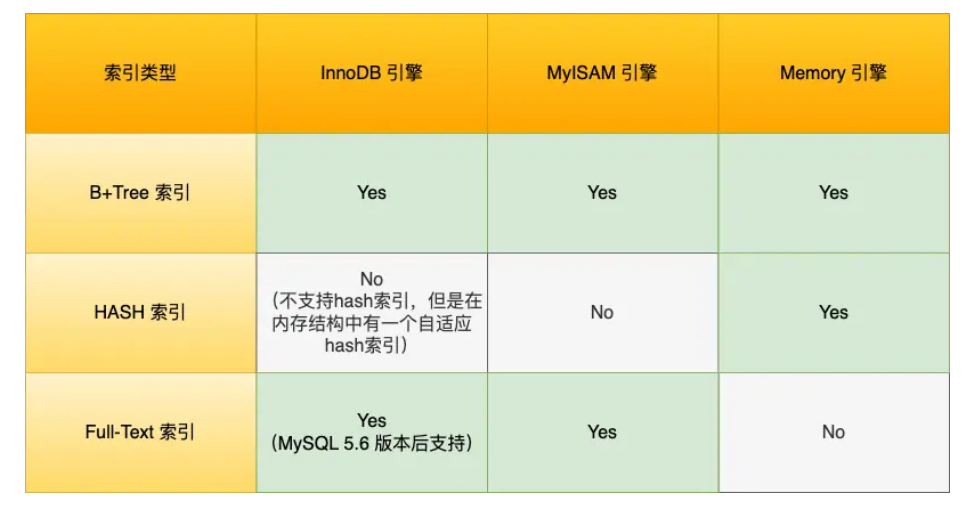

## 约束
在创建表的时候，我们可以给表中的字段加上一些约束，来保证这个表中数据的完整性、有效性

约束包括：
+ 非空约束：not null，非空约束所约束的字段不能为null
+ 唯一性约束：unique，唯一性约束unique约束的字段不能重复，但是可以为NULL
+ 主键约束：primary key，主键值是每一行记录的唯一标识，主键的特征：not null + unique
+ 外键约束：foreign key
  + 注意：添加了外键约束，表与表之间产生了父子关系。 例如t_class是父表、t_student是子表
    + 删除表的顺序：先删子，再删父
    + 创建表的顺序：先创建父，再创建子
    + 删除数据的顺序：先删子，再删父
    + 插入数据的顺序：先插入父，再插入子
    + 子表中的外键引用的附表中的某个字段，被引用的这个字段不一定是主键，但至少具有unique唯一性。 外键可以为null。
+ 检查约束：check（mysql不支持，Oracle支持）
+ 默认约束：default，DEFAULT 约束用于向列中插入默认值

## 存储引擎
查看 MySQL 支持的存储引擎: `show engines`
```sql
mysql> select version();
+-----------+
| version() |
+-----------+
| 5.7.42    |
+-----------+
1 row in set (0.00 sec)

mysql> show engines;
+--------------------+---------+----------------------------------------------------------------+--------------+------+------------+
| Engine             | Support | Comment                                                        | Transactions | XA   | Savepoints |
+--------------------+---------+----------------------------------------------------------------+--------------+------+------------+
| InnoDB             | DEFAULT | Supports transactions, row-level locking, and foreign keys     | YES          | YES  | YES        |
| MRG_MYISAM         | YES     | Collection of identical MyISAM tables                          | NO           | NO   | NO         |
| MEMORY             | YES     | Hash based, stored in memory, useful for temporary tables      | NO           | NO   | NO         |
| BLACKHOLE          | YES     | /dev/null storage engine (anything you write to it disappears) | NO           | NO   | NO         |
| MyISAM             | YES     | MyISAM storage engine                                          | NO           | NO   | NO         |
| CSV                | YES     | CSV storage engine                                             | NO           | NO   | NO         |
| ARCHIVE            | YES     | Archive storage engine                                         | NO           | NO   | NO         |
| PERFORMANCE_SCHEMA | YES     | Performance Schema                                             | NO           | NO   | NO         |
| FEDERATED          | NO      | Federated MySQL storage engine                                 | NULL         | NULL | NULL       |
+--------------------+---------+----------------------------------------------------------------+--------------+------+------------+
9 rows in set (0.00 sec)

mysql>
```
MyISAM存储引擎
+ 不支持事务和行级锁
+ 用分离的索引文件和文件数据组织数据
  + 格式文件 – 存储表结构的定义（mytable.frm） 
  + 数据文件 – 存储表行的内容（mytable.MYD） 
  + 索引文件 – 存储表上索引（mytable.MYI） 

InnoDB存储引擎
+ mysql默认的存储引擎，同时也是一个重量级的存储引擎
+ InnoDB 支持事务，行级锁，外键约束
+ 持数据库崩溃后自动恢复机制

MEMORY存储引擎
+ 数据存储在内存中，且行的长度固定，速度非常快
+ 有数据丢失的风险，因为数据和索引都是在内存当中

## 索引
帮助存储引擎快速查找数据的一种数据结构

操作：
+ 创建索引：`create index <索引名> on <表名> (列名，列名,.....)`
+ 删除索引：`drop index <索引名> on <表名>`
+ 修改索引：mysql中无法修改索引，需要先删除旧索引，再新建索引

+ 按 数据结构 分类：B+tree索引、Hash索引、Full-text索引
  
+ 按 物理存储 分类：聚簇索引（主键索引）、二级索引（辅助索引）
  + 主键索引中的叶子结点存储的实际的数据，辅助索引的叶子结点存放的是主键值，而不是实际数据
  + 在查询时使用了辅助索引，如果数据在辅助索引里查询到，就不需要回表；如果查询不到，就需要回表，获取主键值后去检索主键索引
+ 按 字段特性 分类：主键索引、唯一索引、普通索引、前缀索引
  + 主键索引：primary key，一张表最多有一个主键索引
  + 唯一索引：unique key，一张表可以有多个唯一索引，允许有空值
  + 普通索引：index，建立在普通字段上的索引，既不要求字段为主键，也不要求字段为 UNIQUE
  + 前缀索引：index，对字符类型字段的前几个字符建立索引，而不是在整个字段上建立索引
    + 目的：减少索引占用的存储空间，提升查询效率
+ 按 字段个数 分类：单列索引、联合索引
  + 单列索引：建立在单列上的索引称为单列索引，比如主键索引
  + 联合索引（复合索引）：建立在多列上的索引称为联合索引

### 索引失效场景

+ 使用左或左右模糊查询的时候
+ 对索引列进行了操作（计算，函数，类型转换）
+ 没有遵循最左匹配原则
+ 在where子句中，如果在 or 前的条件列是索引列，而在 or 后条件不是索引列

## 事务

## 日志

## 锁


