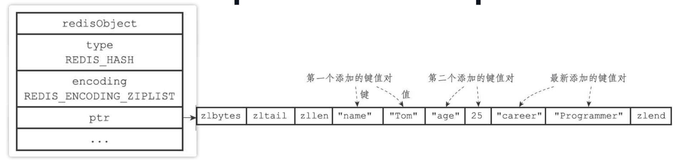
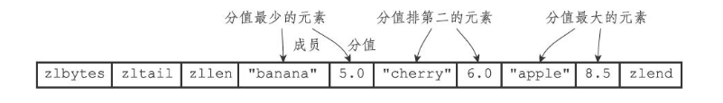
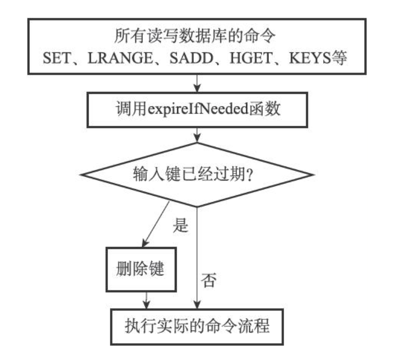
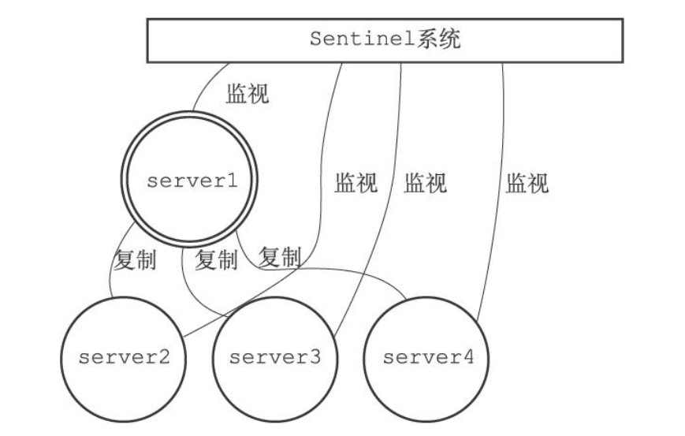
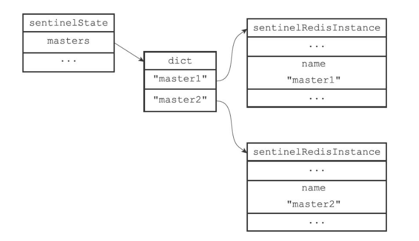
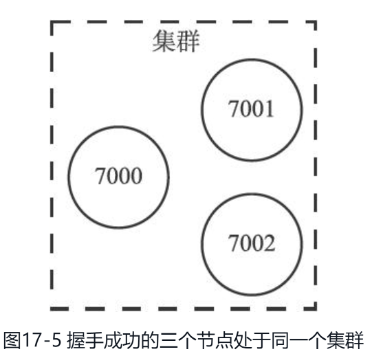

## 数据结构

### SDS
Simple Dynamic String，简单动态字符串
```c++
struct sdshdr {
    // 记录buf数组中已使用字节的数量
    // 等于SDS所保存字符串的长度
    int len;
    // 记录buf数组中未使用字节的数量
    int free;
    // 字节数组，用于保存字符串，最后一位是空字符 '\0',不计入字符串长度
    char buf[];
};
```
优点（对比 C 字符串）：
+ 通过 len 属性可以常数级别获取字符串长度
+ 通过 free 属性可以防止缓冲区溢出，当追加字符串时，如果添加的字符串长度大于 free，会触发扩容操作，重新分配内存
  + 当修改后的 SDS 长度小于 1MB, 会多分配相同大小的未使用空间，这时 len = free
  + 当修改后的 SDS 长度大于 1MB, 会多分配 1MB 大小的未使用空间，这时 free = 1MB
+ 最大数据长度为 512 MB
+ 惰性空间释放，减少内存分配次数，当修改字符串长度时，不会立即释放多余的内存空间
+ 二进制安全
+ 兼容部分 C 函数

### 链表
Redis 中通过链表（双向链表）实现列表键，发布与订阅，慢查询，监视器等功能
```C++
typedef struct listNode {
    // 前置节点
    struct listNode * prev;
    // 后置节点
    struct listNode * next;
    // 节点的值
    void * value;
}listNode;

typedef struct list {
    // 表头节点
    listNode * head;
    // 表尾节点
    listNode * tail;
    // 链表所包含的节点数量
    unsigned long len;
    // 节点值复制函数
    void *(*dup)(void *ptr);
    // 节点值释放函数
    void (*free)(void *ptr);
    // 节点值对比函数
    int (*match)(void *ptr,void *key);
} list;
```


### 字典
Redis 中的字典通过哈希表实现，每个字典中有两个哈希表，一个平时使用，另一个仅在rehash时使用。当发生哈希冲突时，通过链地址法解决冲突，并且使用的是头插法。
```C++
// 字典
typedef struct dict {
    //类型特定函数
    dictType *type;
    //私有数据
    void *privdata;
    //哈希表
    dictht ht[2];
    // rehash索引
    //当rehash不在进行时，值为-1
    in trehashidx; /* rehashing not in progress if rehashidx == -1 */
} dict;

// 哈希表
typedef struct dictht {
    // 哈希表数组
    dictEntry **table;
    // 哈希表大小
    unsigned long size;
    // 哈希表大小掩码，用于计算索引值
    // 总是等于size-1
    unsigned long sizemask;
    // 该哈希表已有节点的数量
    unsigned long used;
} dictht;

// 哈希表节点
typedef struct dictEntry {
    // 键
    void *key;
    // 值
    union{
        void *val;
        uint64_tu64;
        int64_ts64;
    } v;
    // 指向下个哈希表节点，形成链表
    struct dictEntry *next;
} dictEntry;
```


关于何时进行哈希表的扩容和收缩操作，由负载因子（**哈希表节点数/哈希表大小**）决定，并且需要满足以下情况：
+ 当服务器没有在执行 bgsave 或者 bgrewriteaof 命令时，并且负载因子 >= 1，进行扩容操作
+ 当服务器正在执行 bgsave 或者 bgrewriteaof 命令时，并且负载因子 >= 5，进行扩容操作
+ 当负载因子小于 0.1 是，进行收缩操作

注意：
+ 哈希表的扩容和收缩操作都是渐进式的，不是一次性完成的
+ 扩容后的哈希表大小为第一个哈希表中节点数的两倍（ht[0].used * 2）
+ 收缩后的哈希表大小为第一个哈希表中节点数（ht[0].used * 2）

### 跳跃表
skiplist，Redis 使用跳跃表作为有序集合键的底层实现之一

```C++
// 该结构保存跳跃表信息
typedef struct zskiplist {
    // 表头节点和表尾节点
    structz skiplistNode *header, *tail;
    // 表中节点的数量
    unsigned long length;
    // 表中层数最大的节点的层数，表头节点的层数不计算在内
    int level;
} zskiplist;

// 该结构保存跳跃节点信息
typedef struct zskiplistNode {
    // 层
    struct zskiplistLevel {
        // 前进指针
        struct zskiplistNode *forward;
        // 跨度
        unsigned int span;
    } level[];
    // 后退指针
    struct zskiplistNode *backward;
    // 分值，通过分值进行排序，如果分值相同，通过字典序排序
    double score;
    // 成员对象
    robj *obj;
} zskiplistNode;
```


### 压缩列表
ziplist，Redis 中为节约内存而开发的一种顺序数据结构，每一个压缩列表可以包含多个节点，每个节点可以保存字节数组或者整数值


+ `zlbytes`：压缩列表的字节数
+ `zltail`：压缩列表的起始位置距离最后一个节点地址有多少字节（偏移量），可以直接确定最后一个节点位置，无需遍历
+ `zllen`：压缩列表中的节点个数


+ `previous_entry_length`: 前一个节点的长度，通过这个字段可以访问前一个节点
+ `encoding`：记录该节点保存的数据是字节数组还是整数值
+ `content`：压缩列表节点保存的数据

## 对象
Redis 中每个对象都由 redisObject 表示
```C++
typedef struct redisObject {
    // 对象的类型(string, list, hash, set, zset),可以通过 type 命令查看
    unsigned type:4;
    // 对象的编码，该对象底层使用的是什么数据结构来实现的
    unsigned encoding:4;
    // 指向底层实现数据结构的指针
    void *ptr;
    // 引用计数，用于内存回收
    int refcount;
    // 记录该对象之后一次被访问的时间
    unsigned lru:22;
    // ...
} robj;
```


### 字符串对象
字符串对象的编码可以是int，raw，embstr
+ int: 当保存的字符串是整数值，并且可以用 long 类型表示，此时字符串对象的 encoding 为 int
+ embstr: 当保存的字符串长度 **小于等于32字节**，此时字符串对象的 encoding 为 embstr
+ raw: 当保存的字符串长度大于 **32字节**，此时字符串对象的 encoding 为 raw

raw 和 embstr 的区别：raw 编码会分配两次内存（分别创建redisObject和SDS），embstr 编码只会分配一次内存（同时创建redisObject和SDS）


### 列表对象
列表对象的编码可以是：ziplist, linkedlist
+ ziplist：当列表对象中所有的字符串长度 <= 64字节，**并且**数量 <= 512个，此时列表对象的 encoding 为 ziplist
+ linkedlist：当列表对象中有一个字符串长度大于64字节，**或者**字符串数量大于512个，此时列表对象的 encoding 为 linkedlist

### 哈希对象
哈希对象的编码可以是：ziplist, hashtable

当使用 ziplist 作为哈希对象的编码时，键值对的键在前，值在后


+ ziplist：当哈希对象中所有的键和值长度 <= 64字节，**并且**键和值的数量 <= 512个，此时哈希对象的 encoding 为 ziplist
+ hashtable：当哈希对象中所有的键和值长度 > 64字节，**或者**键和值的数量 > 512个，此时哈希对象的 encoding 为 hashtable

### 集合对象
集合对象的编码可以是：intset, hashtable

+ intset：当集合对象中所有元素都是整数值，**并且**元素的数量 <= 512个，此时集合对象的 encoding 为 intset
+ hashtable：当集合对象中所有元素有一个非整数值，**或者**元素的数量 > 512个，此时集合对象的 encoding 为 hashtable

### 有序集合对象
有序集合对象的编码可以是：ziplist, skiplist

当有序集合对象使用 ziplist 编码时，第一个节点保存元素，第二个节点保存分值


+ ziplist: 当有序集合对象保存的所有元素的长度 <= 64字节，**并且**元素元素的数量 <= 512个，此时有序集合对象的 encoding 为 ziplist
+ skiplist: 当有序集合对象保存的元素的长度有一个 > 64字节，**或者**元素元素的数量 > 512个，此时有序集合对象的 encoding 为 skiplist

## 数据库
```C++
// Redis服务器
struct redisServer {
    // ...
    // 一个数组，保存着服务器中的所有数据库
    redisDb *db;
    // 服务器数据库的数量,默认是16个
    int dbnum;
    // ...
};

// Redis数据库
typedef struct redisDb {
    // ...
    // 数据库键空间（数据字典），保存着数据库中的所有键值对
    dict *dict;
    // 过期字典，保存着键过期的时间
    dict *expires;
    // ...
} redisDb;
```


### 数据库操作
+ `select index`：切换数据库，index 默认为0，表示切换到第几个数据库
+ `set key value`: 添加键值对，key 是一个字符对象，value 是 Redis 中任意对象
+ `del key`: 删除键值对
+ `set key value`: 修改键值对，存在对应的 key 时，会修改对应的值对象
+ `get key`: 获取键值对
+ `flushdb`: 清空当前数据库
+ `expire key`: 设置对象存活时间，单位 秒
+ `persist key`: 移除键的过期时间
+ `ttl key`: 返回对象的剩余存活时间，单位 秒

### 过期处理
Redis 过期键删除策略: **惰性删除** 和 **定期删除**
> + 定时删除：设置键设置过期时间时，同时设置一个定时器，当过期时间到了，就执行删除操作
>   + 对内存友好，会及时删除过期数据
>   + 对 CPU 不友好，在过期键比较多时，删除操作会占用过多的 CPU 时间，影响服务响应时间
> + 惰性删除：在获取键时，检查是否过期，如果过期了就删除，没有过期，就取出数据
>   + 对 CPU 友好，只有在取出键时，才会删除
>   + 对内存不友好，如果有较多过期键，又长时间没被访问，就会浪费过多内存，有内存泄漏风险
> + 定期删除：每隔一段时间，定期对数据库进行检查，删除过期键
>   + 是定时删除和惰性删除的折中，需要控制执行时长和频率


过期键的惰性删除策略由`db.c/expireIfNeeded`函数实现，所有读写数据库的Redis命令在执行之前都会调用expireIfNeeded函数对输入键进行检查



过期键的定期删除策略由`redis.c/activeExpireCycle`函数实现，它在规定的时间内，分多次遍历服务器中的各个数据库，从数据库的expires字典中随机检查一部分键的过期时间，并删除其中的过期键。

## 持久化

### RDB 持久化

+ save: 会阻塞主进程，在此期间无法处理任何请求
+ bgsave: 会 fork 子进程，由子进程来进行 RDB 操作，不会阻塞主进程

RDB 文件保存的是数据库中的数据，包含键值对的对象类型信息，过期时间，存在于哪个数据库等信息

### AOF 持久化

AOF 文件保存的是修改数据库状态的命令，如果发送`set msg "hello"`这个命令，会将该命令保存到 AOF 文件中

**AOF 持久化实现**
1. 命令追加，服务器在执行完一个写命令后，会将该命令保存到 aof_buf 缓冲区中
2. 文件写入，将 aof_buf 中的数据写入到 AOF 文件，但此时数据并没有写到磁盘上，写入的数据保存在一个内存缓冲区中（不同于 aof_buf ）
3. 文件同步，执行`fsync`或`fdatasync`系统同步函数，可以强制让操作系统将内存缓冲区中的数据写入到磁盘上
   1. always：每个事件循环都将 aof_buf 中的数据写入到 aof 文件中，并同步 aof 文件
   2. everysec: 每个事件循环都将 aof_buf 中的数据写入到 aof 文件中，并**每秒**同步 aof 文件一次
   3. no：每个事件循环都将 aof_buf 中的数据写入到 aof 文件中，但何时同步 aof 文件，由操作系统决定

**AOF 文件重写实现**
1. 执行`bgrewriteaof`命令进行 aof 文件重写，该命令会 fork 出子进程并维护 aof 重写缓冲区来保证数据的一致性
2. 子进程会通过读取当前数据库状态，重新生成 aof 文件，来实现 aof 文件重写
3. 子进程完成 aof 重写之后，会将 aof 重写缓存区中的数据追加到新的 aof 文件中
4. 将新的 aof 文件替换旧的 aof 文件

## 事务
+ `mulit`: 开启事务
+ `exec`: 提交事务

在提交事务之前的命令会保存到一个命令数组中，在提交之后会按照FIFO的顺序执行命令数组中的命令（**注意**：Redis 中的事务不保证原子性）

## 主从复制
为了维持 Redis 服务器之间的数据一致性

### 同步
+ **完整重同步：处理初次同步的情况**
  + 从服务器向主服务器发送 psync 命令
  + 主服务器接收到 psync 命令后会 生成 RDB 文件，并发送给 从服务器
  + 从服务器接收到 RDB 文件后，更新数据库状态
  + 主服务器将缓冲区中的写命令发送给从服务器，从服务器执行这些命令
+ **部分重同步：处理断线重连的情况**
  + 从服务器重连的时候，会发送 psync 命令，并带上**主服务器的运行ID**和**复制偏移量**
  + 主服务器接收到 psync 命令后，会判断运行ID是否相同
    + 如果不相同，执行完全同步
    + 如果相同，执行部分同步
  + 检查从服务器的复制偏移量存在于主服务器的**复制积压缓冲区中（一个队列，默认大小为 1 MB）**
    + 如果不存在，进行完全同步
    + 如果存在，将发送 +continue 回复给从服务器，表示以部分同步进行数据同步
  + 主服务器发送缺失数据，从服务器接收缺失数据并执行

### 命令传播
主服务器通过向从服务器传播命令来更新从服务器的状态，保持主从服务器一致，而从服务器则通过向主服务器发送命令来进行心跳检测，以及命令丢失检测。

## 哨兵模式
Redis2.8 后实现 哨兵模式，实现主节点故障转移。如果主节点下线，会在从节点中选举出新的主节点。

### 基本结构

```c++
// 保存所有和 Sentinel 功能有关的状态
struct sentinelState {
    // 当前纪元，用于实现故障转移
    uint64_t current_epoch;
    // 保存了所有被这个sentinel监视的主服务器 (key: 主服务器的名字  value: 一个指向sentinelRedisInstance结构的指针)
    dict *masters;
    // 是否进入了TILT模式
    int tilt;
    // 目前正在执行的脚本的数量
    int running_scripts;
    // 进入TILT模式的时间
    mstime_t tilt_start_time;
    // 最后一次执行时间处理器的时间
    mstime_t previous_time;
    // 一个FIFO队列，包含了所有需要执行的用户脚本
    list *scripts_queue;
} sentinel;

// 被 Sentinel 监视的实例结构
typedef struct sentinelRedisInstance {
    // 标识值，记录了实例的类型，以及该实例的当前状态
    int flags;
    // 实例的名字，主服务器的名字由用户在配置文件中设置
    char *name;
    // 实例的运行ID
    char *runid;
    // 配置纪元，用于实现故障转移
    uint64_t config_epoch;
    // 实例的地址
    sentinelAddr *addr;
    // 实例无响应多少毫秒之后才会被判断为主观下线
    mstime_t down_after_period;
    // 判断这个实例为客观下线所需的支持投票数量
    int quorum;
    // 在执行故障转移操作时，可以同时对新的主服务器进行同步的从服务器数量
    int parallel_syncs;
    // 刷新故障迁移状态的最大时限
    mstime_t failover_timeout;
    // ...
} sentinelRedisInstance;
```


### 主观下线
1. Sentinel 会定时（每秒一次）向与它进行连接的服务（主服务器，从服务器，其他 Sentinel）发送 Ping 命令
2. 如果在规定的时间内没有返回有效回复，会修改对应实例结构的 flags 属性为 `SRI_S_DOWN` 
   1. 规定的时间由配置文件中的`down-after-milliseconds`选项决定
   2. 有效回复包含：+PONG, -LOADING, -MASTERDOWN

**注意**：不同 sentinel 的主观下线时长可以不同

### 客观下线
当一个 Sentinel 将一个主服务器判断为主观下线后，为了确认该主服务器是否下线，会询问其他 Sentinel 是否也认为该主服务器下线，当一定数量的 Sentinel 认为该主服务器下线，就判定为客观下线，进行故障转移操作。

1. 询问其他 Sentinel: `SENTINEL is-master-down-by-addr ＜ip＞ ＜port＞ ＜current_epoch＞ ＜runid＞`
2. 其他 Sentinel 接收该并分析该命令，检查主服务器是否下线，然后返回结果：`1) ＜down_state＞ 2)＜leader_runid＞ 3)＜leader_epoch＞`
3. 接收回复命令，进行统计，当同意下线的 Sentinel 数量大于等于 `quorum`，判定该主服务器客观下线

**注意**：不同 sentinel 的客观下线数量可以不同

### 选举领头 Sentinel
在进行故障转移操作前，需要选举出一个 leader 去进行具体的转移操作，每一个 Sentinel 都有被选举为 leader 的机会

1. 确认主服务器客观下线的 Sentinel 会参与 leader 的竞选，要求其他 Sentinel 设置自己为局部 leader
2. 每个 Sentinel 只有一次设置局部 leader 的机会，所以遵循先到先得的规则，谁的投票请求先到，就将谁设置为局部 leader
3. 每个参数竞选的 Sentinel 会统计自己获取的局部 leader 票数
   1. 若超过半数，则其就成为真正的 leader，进行后继的故障转移操作
   2. 若为超过，则重新竞选

### 故障转移
1. 从已经下线的主服务器的从服务器中选出一个作为新的主服务器
   1. 删除已经下线或者处于断线状态的从服务器，保证剩下的从服务器是正常在线的
   2. 删除 5s 内没有回复领头 Sentinel 的 INFO 命令的，保证剩余的服务器最近的通信都是成功的
   3. 删除所有与已下线的主服务器连接断开草稿 `down-after-milliseconds * 10` 毫秒的从服务器，保证剩余的从服务器中保存的数据是比较新的
   4. 根据从服务器的优先级进行排序，选出优先级最高的从服务器
      1. 如果有多个最高优先级相同的从服务器，那么会选择复制偏移量最大的从服务器
      2. 如果最大复制偏移量也有多个，选择运行ID最小的从服务器
2. 当新的主服务器出现后，领头 Sentinel 向剩下的从服务器发送 SLAVEOF 命令，让它们对主服务器进行复制操作，保证数据的一致性（弱一致性）
3. 监视已下线的旧主服务器，如果再次上线，将其设置为新主服务器的从服务器


## 集群
一个集群由多个节点组成，通过 `CLUSTER MEET <ip> <port>` 命令添加节点


### 数据分片
Redis 集群通过分片的方式保存键值对，整个集群分为 16384 个槽，每个节点可以处理的槽在 0 ~ 16384 之间。当所有的槽都有节点在处理时，集群处于上线状态；如果有一个槽没有被处理，集群则处于下线状态。使用 `CLUSTER ADDSLOTS ＜slot＞ [slot ...]` 命令进行槽分配。

1. 根据键值对的 key，安装 CRC16 算法计算一个16bit的值
2. 再用 16bit 值对 16384 取模，得到一个在 0~16384 范围内的数值，每个数值代表对应的编号的哈希槽


