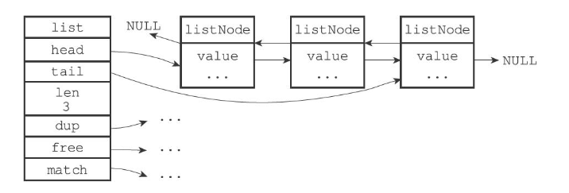
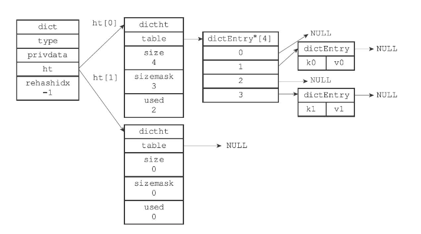
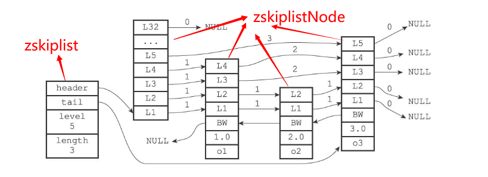
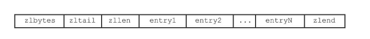
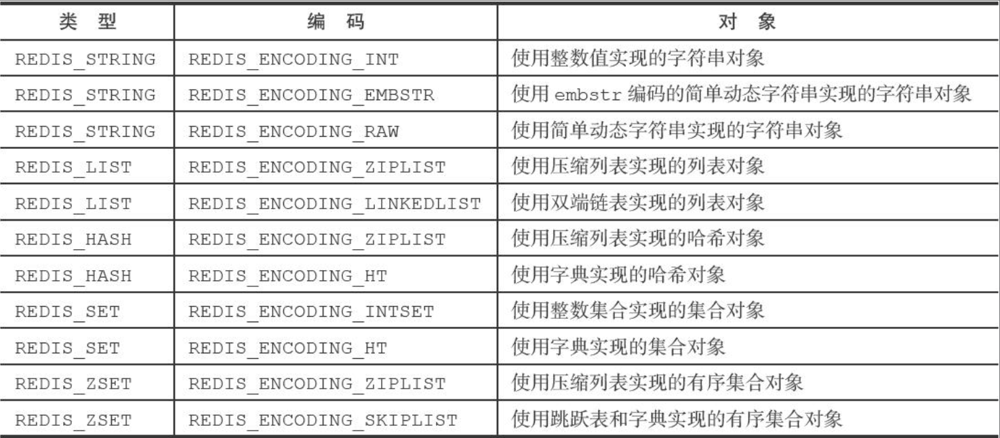
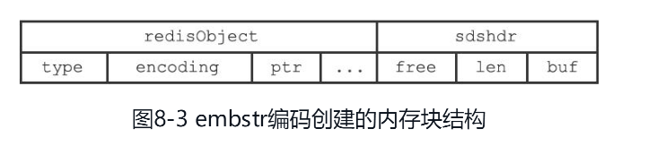
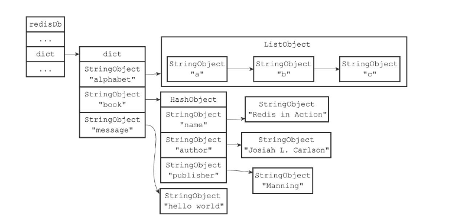

## 数据结构

### SDS
Simple Dynamic String，简单动态字符串
```c++
struct sdshdr {
    //记录buf数组中已使用字节的数量
    //等于SDS所保存字符串的长度
    int len;
    //记录buf数组中未使用字节的数量
    int free;
    //字节数组，用于保存字符串，最后一位是空字符 '\0',不计入字符串长度
    char buf[];
};
```
优点（对比 C 字符串）：
+ 通过 len 属性可以常数级别获取字符串长度
+ 通过 free 属性可以防止缓冲区溢出，当追加字符串时，如果添加的字符串长度大于 free，会触发扩容操作，重新分配内存
  + 当修改后的 SDS 长度小于 1MB, 会多分配相同大小的未使用空间，这时 len = free
  + 当修改后的 SDS 长度大于 1MB, 会多分配 1MB 大小的未使用空间，这时 free = 1MB
+ 惰性空间释放，减少内存分配次数，当修改字符串长度时，不会立即释放多余的内存空间
+ 二进制安全
+ 兼容部分 C 函数

### 链表
Redis 中通过链表（双向链表）实现列表键，发布与订阅，慢查询，监视器等功能
```C++
typedef struct listNode {
    // 前置节点
    struct listNode * prev;
    // 后置节点
    struct listNode * next;
    // 节点的值
    void * value;
}listNode;

typedef struct list {
    // 表头节点
    listNode * head;
    // 表尾节点
    listNode * tail;
    // 链表所包含的节点数量
    unsigned long len;
    // 节点值复制函数
    void *(*dup)(void *ptr);
    // 节点值释放函数
    void (*free)(void *ptr);
    // 节点值对比函数
    int (*match)(void *ptr,void *key);
} list;
```


### 字典
Redis 中的字典通过哈希表实现，每个字典中有两个哈希表，一个平时使用，另一个仅在rehash时使用。当发生哈希冲突时，通过链地址法解决冲突，并且使用的是头插法。
```C++
// 字典
typedef struct dict {
    //类型特定函数
    dictType *type;
    //私有数据
    void *privdata;
    //哈希表
    dictht ht[2];
    // rehash索引
    //当rehash不在进行时，值为-1
    in trehashidx; /* rehashing not in progress if rehashidx == -1 */
} dict;

// 哈希表
typedef struct dictht {
    // 哈希表数组
    dictEntry **table;
    // 哈希表大小
    unsigned long size;
    // 哈希表大小掩码，用于计算索引值
    // 总是等于size-1
    unsigned long sizemask;
    // 该哈希表已有节点的数量
    unsigned long used;
} dictht;

// 哈希表节点
typedef struct dictEntry {
    // 键
    void *key;
    // 值
    union{
        void *val;
        uint64_tu64;
        int64_ts64;
    } v;
    // 指向下个哈希表节点，形成链表
    struct dictEntry *next;
} dictEntry;
```


关于何时进行哈希表的扩容和收缩操作，由负载因子（**哈希表节点数/哈希表大小**）决定，并且需要满足以下情况：
+ 当服务器没有在执行 bgsave 或者 bgrewriteaof 命令时，并且负载因子 >= 1，进行扩容操作
+ 当服务器正在执行 bgsave 或者 bgrewriteaof 命令时，并且负载因子 >= 5，进行扩容操作
+ 当负载因子小于 0.1 是，进行收缩操作

注意：
+ 哈希表的扩容和收缩操作都是渐进式的，不是一次性完成的
+ 扩容后的哈希表大小为第一个哈希表中节点数的两倍（ht[0].used * 2）
+ 收缩后的哈希表大小为第一个哈希表中节点数（ht[0].used * 2）

### 跳跃表
skiplist，Redis 使用跳跃表作为有序集合键的底层实现之一

```C++
// 该结构保存跳跃表信息
typedef struct zskiplist {
    // 表头节点和表尾节点
    structz skiplistNode *header, *tail;
    // 表中节点的数量
    unsigned long length;
    // 表中层数最大的节点的层数，表头节点的层数不计算在内
    int level;
} zskiplist;

// 该结构保存跳跃节点信息
typedef struct zskiplistNode {
    // 层
    struct zskiplistLevel {
        // 前进指针
        struct zskiplistNode *forward;
        // 跨度
        unsigned int span;
    } level[];
    // 后退指针
    struct zskiplistNode *backward;
    // 分值，通过分值进行排序，如果分值相同，通过字典序排序
    double score;
    // 成员对象
    robj *obj;
} zskiplistNode;
```



### 压缩列表
ziplist，Redis 中为节约内存而开发的一种顺序数据结构，每一个压缩列表可以包含多个节点，每个节点可以保存字节数组或者整数值


+ `zlbytes`：压缩列表的字节数
+ `zltail`：压缩列表的起始位置距离最后一个节点地址有多少字节（偏移量），可以直接确定最后一个节点位置，无需遍历
+ `zllen`：压缩列表中的节点个数


+ `previous_entry_length`: 前一个节点的长度，通过这个字段可以访问前一个节点
+ `encoding`：记录该节点保存的数据是字节数组还是整数值
+ `content`：压缩列表节点保存的数据

## 对象
Redis 中每个对象都由 redisObject 表示
```C++
typedef struct redisObject {
    // 对象的类型(string, list, hash, set, zset),可以通过 type 命令查看
    unsigned type:4;
    // 对象的编码，该对象底层使用的是什么数据结构来实现的
    unsigned encoding:4;
    // 指向底层实现数据结构的指针
    void *ptr;
    // 引用计数，用于内存回收
    int refcount;
    // 记录该对象之后一次被访问的时间
    unsigned lru:22;
    // ...
} robj;
```



### 字符串对象
字符串对象的编码可以是int，raw，embstr
+ int: 当保存的字符串是整数值，并且可以用 long 类型表示，此时字符串对象的 encoding 为 int
+ embstr: 当保存的字符串长度 **小于等于32字节**，此时字符串对象的 encoding 为 embstr
+ raw: 当保存的字符串长度大于 **32字节**，此时字符串对象的 encoding 为 raw

raw 和 embstr 的区别：raw 编码会分配两次内存（分别创建redisObject和SDS），embstr 编码只会分配一次内存（同时创建redisObject和SDS）



### 列表对象
列表对象的编码可以是：ziplist, linkedlist
+ ziplist：当列表对象中所有的字符串长度 <= 64字节，**并且**数量 <=512个，此时列表对象的 encoding 为 ziplist
+ linkedlist：当列表对象中有一个字符串长度大于64字节，**或者**字符串数量大于512个，此时列表对象的 encoding 为 linkedlist

### 哈希对象
ziplist, hashtable

### 集合对象
intset, hashtable

### 有序集合对象
ziplist, skiplist


## 数据库
```C++
// Redis服务器
struct redisServer {
    // ...
    // 一个数组，保存着服务器中的所有数据库
    redisDb *db;
    // 服务器数据库的数量,默认是16个
    int dbnum;
    // ...
};

// Redis数据库
typedef struct redisDb {
    // ...
    // 数据库键空间（数据字典），保存着数据库中的所有键值对
    dict *dict;
    // 过期字典，保存着键过期的时间
    dict *expires;
    // ...
} redisDb;
```


### 数据库操作
+ `select index`：切换数据库，index 默认为0，表示切换到第几个数据库
+ `set key value`: 添加键值对，key 是一个字符对象，value 是 Redis 中任意对象
+ `del key`: 删除键值对
+ `set key value`: 修改键值对，存在对应的 key 时，会修改对应的值对象
+ `get key`: 获取键值对
+ `flushdb`: 清空当前数据库
+ `expire key`: 设置对象存活时间，单位 秒
+ `persist key`: 移除键的过期时间
+ `ttl key`: 返回对象的剩余存活时间，单位 秒

过期键删除策略


## RDB 持久化
## AOF 持久化


