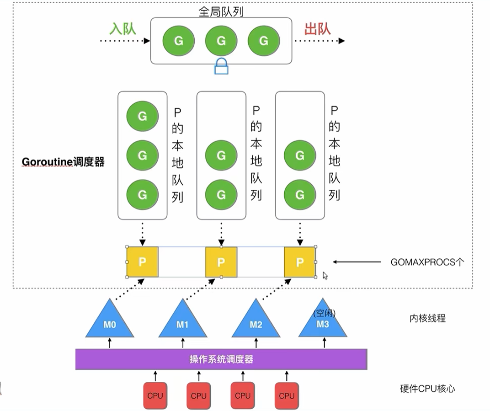
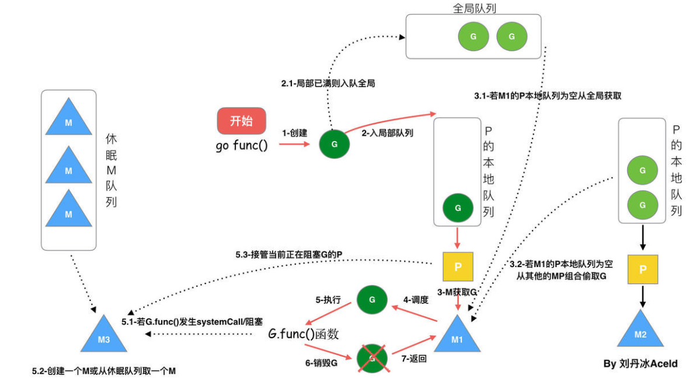
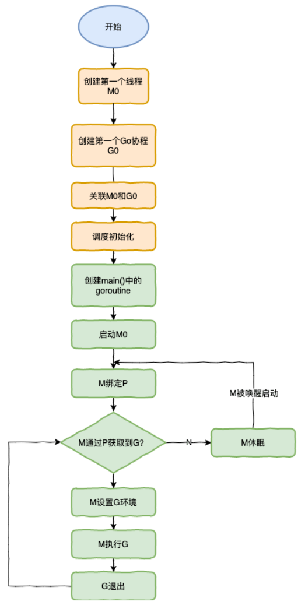

参考链接：https://learnku.com/articles/41728

## GMP 模型

+ G: goroutine, 协程, 内存占用小, 切换速度快（切换在用户态完成）
+ M: machine thread, 内核线程
+ P: processor, goroutine 调度器, 将可运行的 goroutine 分配到工作线程上
+ P 的本地队列: 存放等待运行的 G, 存放的数量有限制, 不超过 256 个
+ P 列表: 所有的 P 在程序启动时创建, 保存在数组中，数量通过 `GOMAXPROCS` 参数配置
+ 全局队列: 存放等待运行的 G

## 调度器的设计策略

### 复用线程
1. work stealing 机制: 当本地线程 M 没有可执行的 G 时, M 会尝试从全局队列中拿一部分 G 放到与之绑定的P, 或者与之绑定的 P 尝试从其他 P 的本地队列中偷取一半的 G 到自己的本地队列中

2. hand off 机制: 当本地线程 M 因 G 进行系统调用而阻塞, M 会释放绑定的 P, 将 P 转移给空闲的线程执行, 如果没有就创建新的线程

### 利用并行
通过 `GOMAXPROCS` 设置 P 的数量，最多有 `GOMAXPROCS` 个线程分布在多个 CPU 上执行

### 抢占
在 coroutine 中要等待一个协程主动让出 CPU 才执行下一个协程

在 Go 中，一个 goroutine 最多占用 CPU 10ms，防止其他 goroutine 被饿死

## 调度过程

## 调度器生命周期
+ M0
  + 程序启动后编号为0的主线程
  + 负责初始化操作和启动第一个 G

+ G0
  + 每次启动一个 M, 都会先创建 G0, 每个 M 都会有一个自己的 G0
  + 负责调度 G, 在调度或系统调用时会使用 G0 的栈空间

