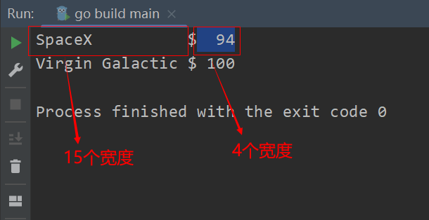
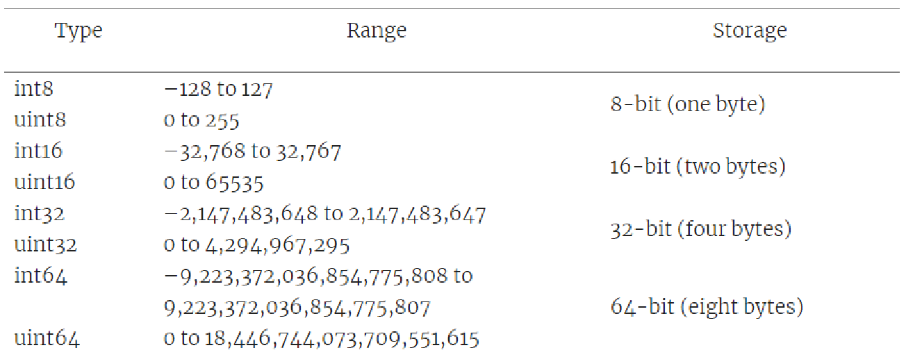
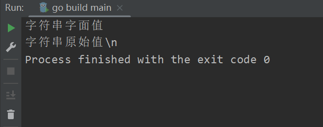
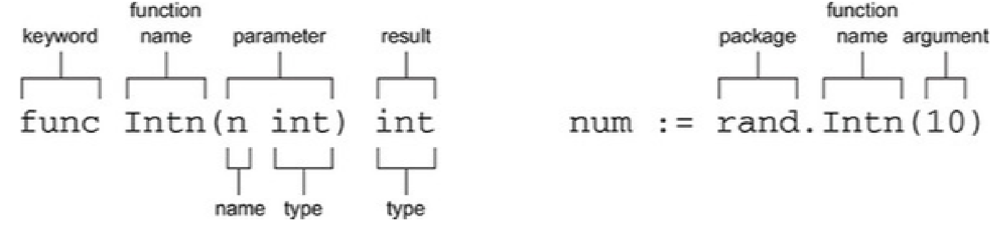
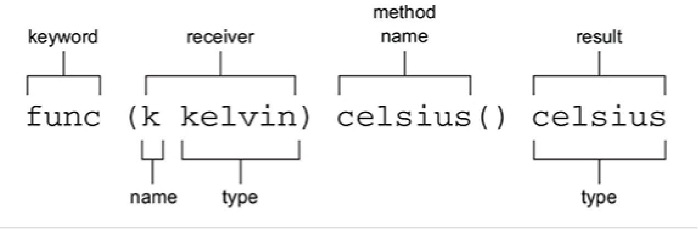
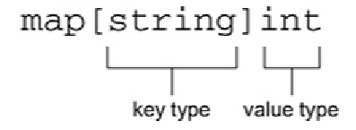
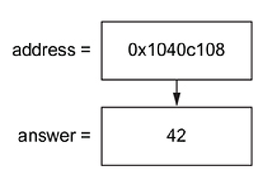

## 介绍

* Go 语言是一门编译语言
  * 在你运行程序之前，Go 首先使用编译器把你的代码转换成机器能够读懂的 1 和 0
  * 它会把你所有的代码编译成一个可执行文件，在编译的过程中，Go编译器能够捕获一些错误
* 不是所有的编程语言都使用这种方式
  * Python、Ruby 等很多语言都是使用解释器，随着程序的运行，一个语句一个语句的进行翻译。但这也意味着 bug 可能就潜伏在你还没有测试过的路径上，这些就是解释型语言

## 基础语法

### 运算符

Go 提供了 *+，-，*，/，%等运算符

注意Go中没有类似于Java中 `++i`这种自增运算符，可以使用 `i++`

```go
package main

import "fmt"

func main() {
	fmt.Println(1 + 1) // 2
	fmt.Println(2 - 1) // 1
	fmt.Println(2 * 2) // 4
	fmt.Println(4 / 2) // 2
	fmt.Println(4 % 3) // 1
}
```

### fmt.Print & fmt.Println & fmt.Printf

Print，Println 函数：

* 可以传递若干个参数，之间用逗号分开
* 参数可以是字符串、数字、数学表达式等等

与 Print 和 Println 不同，Printf 的第一个参数必须是字符串

* 这个字符串里包含了像 %v 这样的格式化动词，它的值由第二个参数的值所代替
* 如果指定了多个格式化动词，那么它们的值由后边的参数值按其顺序进行替换

```go
package main

import "fmt"

// 使用Printf对齐文本
func main() {
	/*
	   在格式化动词里指定宽度，就可以对齐文本。
	   例如，%4v，就是向左填充到足够4个宽度
	   正数，向左填充空格
	   负数，向右填充空格
	*/
	fmt.Printf("%-15v $%4v\n", "SpaceX", 94)
	fmt.Printf("%-15v $%4v\n", "Virgin Galactic", 100)
}
```



### 变量 & 常量

const，用来声明常量，常量的值不可以改变

var，用来声明变量，想要使用变量首先需要进行声明

### 分支 & 循环

if 分支

```go
package main

import "fmt"

func main() {
	var scores int = 88

	if 0 <= scores && scores < 60 {
		fmt.Println("不及格")
	} else if 60 <= scores && scores < 90 {
		fmt.Println("良好")
	} else if 90 < scores {
		fmt.Println("优秀")
	} else {
		fmt.Println("成绩不合法")
	}
}
```

switch 分支

* switch 还有一个 fallthrough 关键字，它用来执行下一个 case 的 body 部分

```go
package main

import "fmt"

func main() {
	var scores int = 88

	switch {
	case 0 <= scores && scores < 60:
		fmt.Println("不及格")
	case 60 <= scores && scores < 90:
		fmt.Println("良好")
		fallthrough
	case 90 <= scores:
		if scores < 90 {
			fmt.Printf("您还差%v分就可以达到优秀程度，请继续加油", 90-scores)
		} else {
			fmt.Println("优秀")
		}
	default:
		fmt.Println("成绩不合法")
	}
}
```

循环

```go
package main

import "fmt"

// 计算1~10的和
func main() {
	sum := 0
	for i := 1; i <= 10; i++ {
		sum += i
	}
	fmt.Println("sum = ", sum) // 55
}
```

## 数据类型

### 浮点型

* 默认是 float64
  * 64 位的浮点类型
  * 占用 8 字节内存
  * 某些编程语言把这种类型叫做 double（双精度）
* float32
  * 占用 4 字节内存
  * 精度比 float64 低
  * 有时叫做单精度类型

### 整数型



int 和 uint

* int 和 uint 是针对目标设备优化的类型
* 在树莓派 2、比较老的移动设备上，int 和 uint 都是 32 位的
* 在比较新的计算机上，int 和 uint 都是 64 位的
* 虽然在某些设备上 int 可以看作是 int32，在某些设备上 int 可以看作是 int64，但它们其实是 3 种不同的类型

### Big 包

* 对于较大的整数（超过1018 ）：big.Int，一旦使用了 big.Int，那么等式里其它的部分也必须使用 big.Int
* 对于任意精度的浮点类型，big.Float
* 对于分数，big.Rat

```go
package main

import (
	"fmt"
	"math/big"
)

func main() {
	// NewInt() 函数可以把 int64 转化为 big.Int 类型
	lightSpeed := big.NewInt(299792)
	secondsPerDay := big.NewInt(86400)
	fmt.Println(lightSpeed, secondsPerDay)

	distance := new(big.Int)
	distance.SetString("2400000000000000000", 10) // 以10进制表示
	fmt.Println("Andromeda Galaxy is ", distance)

	seconds := new(big.Int)
	seconds.Div(distance, lightSpeed)

	days := new(big.Int)
	days.Div(seconds, secondsPerDay)

	fmt.Println("That is", days, "days of travel at light speed")
}
```

## string

声明：

* `peace := "peace"`
* `var peace = "peace"`
* `var peace string = "peace"`

### 字符串字面值 & 原始字符串字面值

字符串字面值可以包含转义字符，例如 \n，但如果你确实想得到 \n 而不是换行的话，可以使用 ` 来代替 “，这叫做原始字符串字面值。

```go
package main

import "fmt"

func main() {
	str1 := "字符串字面值\n"
	str2 := `字符串原始值\n`
	fmt.Printf(str1)
	fmt.Printf(str2)
}
```



## 函数

在 Go 里，使用 func 关键字声明函数，大写字母开头的函数、变量或其它标识符都会被导出，对其它包可用，小写字母开头的就不行



函数可以有多个参数，如果多个形参类型相同，那么该类型只写一次即可

```go
func Unix(sec int64, nsec int64) Time
func Unix(sec, nsec int64) Time
```

函数可以有多个返回值，函数的多个返回值需要用括号括起来。声明函数时可以把名字去掉，只保留类型

```go
package main

import (
	"fmt"
	"strconv"
)

func main() {
	countdown, err := strconv.Atoi("10")
	if err == nil {
		fmt.Println(countdown)
	}
}

func Atoi(s string) (int, error) {....}
```

函数的参数数量是可变的，… 和空接口组合到一起就可以接受任意数量、类型的参数，比如Println函数

```go
// Println函数的声明
// ... 表示函数的参数的数量是可变的 
参数 a 的类型为 interface{}，是一个空接口

func Println(a ...interface{}) (n int, err error) {
	return Fprintln(os.Stdout, a...)
}
```

## 方法

在 C#、Java 里，方法属于类。在 Go 里，它提供了方法，但是没提供类和对象

可以将方法与同包中声明的任何类型相关联，但不可以是 int、float64 等预声明的类型进行关联



```go
package main

import "fmt"

func main() {
	var k kelvin = 294.0
	var c celsius

	c = kelvinToCelsius(k) // 调用函数
	c = k.celsius()        // 调用方法

	fmt.Println(c) // 20.850000000000023
}

// 给类型声明别名，但不可以和原类型混用
type kelvin float64
type celsius float64

// 函数
func kelvinToCelsius(k kelvin) celsius {
	return celsius(k - 273.15)
}

// 方法，接收者是kelvin
func (k kelvin) celsius() celsius {
	return celsius(k - 273.15)
}
```

## 一等函数

* 在 Go 里，函数是头等的，它可以用在整数、字符串或其它类型能用的地方:
  * 将函数赋给变量
    ```go
    package main

    import (
    	"fmt"
    	"math/rand"
    )

    func main() {
    	// 变量 sensor 就是一个函数，而不是函数执行的结果
    	// 这个变量的类型是函数，该函数没有参数，返回一个 kelvin 类型的值。
    	sensor := fakeSensor
    	fmt.Println(sensor())

    	sensor = realSensor
    	fmt.Println(sensor())
    }

    type kelvin float64

    func fakeSensor() kelvin {
    	return kelvin(rand.Intn(151) + 150)
    }

    func realSensor() kelvin {
    	return 0
    }
    ```
  * 将函数作为参数传递给函数
  * 将函数作为函数的返回类型

## 数组

数组是一种固定长度且有序的元素集合

* 数组中的每个元素都可以通过[ ] 和一个从 0 开始的索引进行访问
* 数组的长度可由内置函数 len 来确定
* 在声明数组时，未被赋值元素的值是对应类型的零值

```go
package main

import "fmt"

func main() {
	// 声明并初始化
	arr := [5]int{1, 2, 3, 4, 5}

	// for 遍历数组
	for i := 0; i < len(arr); i++ {
		fmt.Printf("%d\t", arr[i])
	}
	fmt.Println()
	// range 遍历数组
	for _, value := range arr {
		fmt.Printf("%d\t", value)
	}
}
```

## slice

指向数组的窗口，切分数组不会导致数组被修改，它只是创建了指向数组的一个窗口或视图，这种视图就是 slice 类型

* Slice 使用的是半开区间
* Slice 的默认索引
  * 忽略掉 slice 的起始索引，表示从数组的起始位置进行切分
  * 忽略掉 slice 的结束索引，相当于使用数组的长度作为结束索引
  * 如果同时省略掉起始和结束索引，那就是包含数组所有元素的一个 slice
  * 注意：slice 的索引不能是负数

```go
package main

import "fmt"

func main() {
	// 声明并初始化
	arr := [5]int{1, 2, 3, 4, 5}

	s := arr[:3]
	printArr(dwarf) // 1       2       3

	s = arr[3:]
	printArr(dwarf) // 4       5

	s = arr[:]
	printArr(dwarf) // 1       2       3       4       5

}

func printArr(arr []int) {
	for i := 0; i < len(arr); i++ {
		fmt.Printf("%d\t", arr[i])
	}
	fmt.Println()
}
```

## map

map 是 Go 提供的另外一种集合：

* 它可以将 key 映射到 value
* 可快速通过 key 找到对应的 value
* 它的 key 几乎可以是任何类型

声明 map，必须指定 key 和 value 的类型：



```go
package main

import "fmt"

func main() {
	// 复合字面值来初始化 map
	temperature := map[string]int{
		"Earth": 15,
		"Mars":  -65,
	}

	// make 初始化 map，第二个参数指定 mao 的初始容量，如果不指定，默认为0
	//temperature := make(map[string]int, 2)
	//temperature["Earth"] = 15
	//temperature["Mars"] = -65

	// 根据key取出value
	temp := temperature["Earth"]
	fmt.Printf("On average the Earth is %v℃\n", temp)

	// 修改map中的值
	temperature["Earth"] = 16
	temperature["Mars"] = 464

	fmt.Println(temperature)

	// 逗号与ok写法：当取出map中不存在的值，ok的值为false，执行else中的代码
	if moon, ok := temperature["Moon"]; ok {
		fmt.Printf("On average the moon is %v℃\n", moon)
	} else {
		fmt.Println("Where is the moon?")
	}

}
```

## struct

为了将分散的零件组成一个完整的结构体，Go 提供了 struct 类型。struct 允许你将不同类型的东西组合在一起。

```go
package main

import (
	"encoding/json"
	"fmt"
	"os"
)

// `json:"age"`，自定义json，表示打印改struct时，该字段显示为age
type User struct {
	Age  int    `json:"age"`
	Name string `json:"name"`
	Addr string `json:"addr"`
}

func main() {

	var user1 User
	user1.Name = "张三"
	user1.Age = 18
	user1.Addr = "江西省九江市"

	user2 := User{Name: "李四", Age: 20, Addr: "江西省九江市"}

	// 不会修改user1中的值
	user3 := user1
	user3.Age = 10

	fmt.Println(user1) // {18 张三 江西省九江市}
	fmt.Println(user2) // {20 李四 江西省九江市}
	fmt.Println(user3) // {10 张三 江西省九江市}

	// 将 struct 装换为 JSON，需要注意的是Marshal 函数只会对 struct 中被导出的字段(首字母是大写的字段)进行编码，
	bytes, err := json.Marshal(user1)
	if err != nil {
		fmt.Printf("转换错误，err: %v\n", err)
		os.Exit(1)
	}
	fmt.Println(string(bytes)) // {"age":18,"name":"张三","addr":"江西省九江市"}

}
```

## 组合与转发
在面向对象的世界中，对象由更小的对象组合而成

Go 通过结构体实现组合(composition)，提供了“嵌入”（embedding）特性，它可以实现方法的转发（forwarding）

**组合是一种更简单、灵活的方式**

```go
package main

import (
	"fmt"
)

type report struct {
	sol         int
	temperature temperature
	location    location
}

// 最高温，最低温
type temperature struct {
	high, low celsius
}

// 纬度，经度
type location struct {
	lat, long float64
}

type celsius float64

// 定义一个 average 方法，接收者是 temperature
func (t temperature) average() celsius {
	return (t.high + t.low) / 2
}

// 方法的转发，定义一个 average 方法，接收者是 report
func (r report) average() celsius {
	return r.temperature.average()
}

func main() {
	bradbury := location{-4.5895, 137.4417}
	t := temperature{high: -1.0, low: -78.0}
	report := report{
		sol:         15,
		temperature: t,
		location:    bradbury,
	}

	fmt.Printf("%+v\n", report)             // {sol:15 temperature:{high:-1 low:-78} location:{lat:-4.5895 long:137.4417}}
	fmt.Printf("%+v\n", report.temperature) // {high:-1 low:-78}

	fmt.Printf("average temperature is %v\n", report.average()) // average temperature is -39.5

}
```

### struct 嵌入实现方法转发
在 struct 中只给定字段类型，不给定字段名即可，并且可以转发任意类型。

## 接口
+ 接口关注于类型可以做什么，而不是存储了什么
+ 接口通过列举类型必须满足的一组方法来进行声明
+ 按约定，接口名称通常以 er 结尾，并且接口都是隐式满足的
+ 接口可以与 struct 嵌入 特性一同使用，同时使用组合和接口将构成非常强大的设计工具

```go
package main

import (
	"fmt"
	"strings"
)

type talker interface {
	talk() string
}

type martian struct{}

func (m martian) talk() string {
	return "nack nack"
}

type laser int

func (l laser) talk() string {
	return strings.Repeat("pew ", int(l))
}

func shout(t talker) {
	louder := strings.ToUpper(t.talk())
	fmt.Println(louder)
}

type starship struct {
	laser
}

func main() {
	shout(martian{}) // NACK NACK
	shout(laser(2))  // PEW PEW

	// 接口可以与 struct 嵌入一起使用
	s := starship{laser(3)}
	fmt.Println(s.talk()) // pew pew pew
	shout(s)              // PEW PEW PEW
}
```

## 指针
**指针是指向另一个变量地址的变量**，Go 语言的指针同时也强调安全性，不会出现迷途指针（dangling pointers）

变量会将它们的值存储在计算机的 RAM 里，存储位置就是该变量的内存地址
+ & 表示地址操作符，通过 & 可以获得变量的内存地址
+ & 操作符无法获得字符串/数值/布尔字面值的地址，`&42，&"hello"`这些都会导致编译器报错
+ `*` 操作符与 & 的作用相反，它用来**解引用**，提供内存地址指向的值



>注意：C 语言中的内存地址可以通过例如 address++ 这样的指针运算进行操作，但是在 Go 里面不允许这种不安全操作。

### 指针类型
指针类型和其它普通类型一样，出现在所有需要用到类型的地方，如变量声明、函数形参、返回值类型、结构体字段等。

#### 结构体指针
与字符串和数值不一样，复合字面量的前面可以放置 &。
访问字段时，对结构体进行解引用并不是必须的。
```go
func main() {
	type person struct {
		name, superpower string
		age              int
	}

	timmy := &person{
		name: "Timothy",
		age:  10,
	}

	timmy.superpower = "flying "
	(*timmy).superpower = "flying"
	fmt.Printf("%+v\n", timmy) // &{name:Timothy superpower:flying age:10}
}
```

#### 指向数组的指针

和结构体一样，可以把 & 放在数组的复合字面值前面来创建指向数组的指针。

数组在执行索引或切片操作时会自动解引用，没有必要写 (*superpower)[0] 这种形式。
与 C 语言不一样，Go 里面数组和指针是两种完全独立的类型。

Slice 和 map 的复合字面值前面也可以放置 & 操作符，但是 Go 并没有为它们提供自动解引用的功能。

```go
func main() {
	superpowers := &[3]string{"flight", "invisibility", "super strength"}

	fmt.Println(superpowers[0])   // flight
	fmt.Println(superpowers[1:2]) // [invisibility]

}
```

## nil
Nil 是一个名词，表示“无”或者“零”。

在 Go 里，nil 是一个零值。如果一个指针没有明确的指向，那么它的值就是 nil。除了指针，nil 还是 slice、map 和接口的零值。

Go 语言的 nil，比以往语言中的 null  更为友好，并且用的没那么频繁，但是仍需谨慎使用。

## Error
+ Go 语言允许函数和方法同时返回多个值
+ 按照惯例，函数在返回错误时，最后边的返回值应用来表示错误
+ 调用函数后，应立即检查是否发生错误
  + 如果没有错误发生，那么返回的错误值为 nil
+ 当错误发生时，函数返回的其它值通常就不再可信
+ 减少错误处理代码的一种策略是：将程序中不会出错的部分和包含潜在错误隐患的部分隔离开来。
+ 对于不得不返回错误的代码，应尽力简化相应的错误处理代码

```go
package main

import (
	"fmt"
	"io/ioutil"
	"os"
)

func main() {
	// 读取当前目录下的文件，如果没有发生错误，打印当前目录下所有文件的文件名
	files, err := ioutil.ReadDir(".")
	if err != nil {
		fmt.Println(err)
		os.Exit(1)
	}

	for _, file := range files {
		fmt.Println(file.Name())
	}
}
```


## goroutine
在 Go 中，独立的任务叫做 goroutine
虽然 goroutine 与其它语言中的协程、进程、线程都有相似之处，但 goroutine 和它们并不完全相同
Goroutine 创建效率非常高
Go 能直截了当的协同多个并发（concurrent）操作
在某些语言中，将顺序式代码转化为并发式代码需要做大量修改
在 Go 里，无需修改现有顺序式的代码，就可以通过 goroutine 以并发的方式运行任意数量的任务。

每次使用 go 关键字都会产生一个新的 goroutine。
表面上看，goroutine 似乎在同时运行，但由于计算机处理单元有限，其实技术上来说，这些 goroutine 不是真的在同时运行。
计算机处理器会使用“分时”技术，在多个 goroutine 上轮流花费一些时间。
在使用 goroutine 时，各个 goroutine 的执行顺序无法确定。


## channel


## 并发状态
