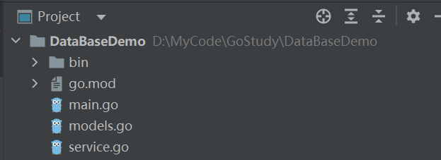

## 连接数据库

1. 下载目标数据库驱动<br/>
   `go get github.com/go-sql-driver/mysql`
2. 注册驱动<br/>
   `import  _ "github.com/go-sql-driver/mysql"`<br/>
   这种方式引入驱动包时，会进行自我注册，执行init方法。正常做法是使用 sql.Register() 函数、数据库驱动的名称和一个实现了 driver.Driver 接口的 struct 来注册数据库的驱动

   ```go
   // driver.go
   func init() {
    	sql.Register("mysql", &MySQLDriver{})
   }
   ```

3. 打开连接sql.Open()

   ```go
   // 连接配置，不同的数据库的配置不同，这里是mysql的配置
   connStr := fmt.Sprintf("%s:%s@tcp(%s:%s)/%s?charset=utf8&parseTime=True&loc=Local",
    user, password, server, port, database)

   // 打开连接
   var err error
   db, err = sql.Open("mysql", connStr)
   if err != nil {
      log.Fatalln(err.Error())
   }
   ```

   注意：sql.Open()得到一个指向sql.DB这个struct的指针sql.DB是用来操作数据库的，它代表了0个或者多个底层连接的池，这些连接由sql包来维护，sql 包会自动的创建和释放这些连接
   * 它对于多个goroutine并发的使用是安全的
   * Open()函数并不会连接数据库，甚至不会验证其参数，它只是把后续连接到数据库所必需的structs给设置好了，而真正的连接是在被需要的时候才进行懒设置的
   * sqI.DB不需要进行关闭(当然你想关闭也是可以的)，它就是用来处理数据库的，而不是实际的连接，这个抽象包含了数据库连接的池，而且会对此进行维护
   * 在使用sql.DB的时候，可以定义它的全局变量进行使用，也可以将它传递函数/方法里
4. 测试连接是否有效

   ```go
   // 验证与数据库的连接是否有效
   ctx := context.Background()
   err = db.PingContext(ctx)
   if err != nil {
      log.Fatalln(err.Error())
   }
   ```

## 操作数据库
目录结构


```go
// main.go
package main

import (
	"context"
	"database/sql"
	"fmt"
	"log"

	_ "github.com/go-sql-driver/mysql"
)

var db *sql.DB

const (
	server   = "127.0.0.1"
	port     = "3306"
	user     = "root"
	password = "123456"
	database = "demo"
)

func main() {
	// 连接配置，不同的数据库的配置不同，这里是mysql的配置
	connStr := fmt.Sprintf("%s:%s@tcp(%s:%s)/%s?charset=utf8&parseTime=True&loc=Local",
		user, password, server, port, database)

	// 打开连接
	var err error
	db, err = sql.Open("mysql", connStr)
	if err != nil {
		log.Fatalln(err.Error())
	}

	// 验证与数据库的连接是否有效
	ctx := context.Background()
	err = db.PingContext(ctx)
	if err != nil {
		log.Fatalln(err.Error())
	}

	fmt.Println("Connected!")

	// 插入数据
	//user1 := userInfo{name: "王五", age: 20}
	//insertUserInfo(user1)

	// 查询单行数据
	//u := queryRow(1)
	//fmt.Println(u)

	// 查询多行数据
	//us := queryRows(0)
	//for _, u := range us {
	//	fmt.Println(u)
	//}

	// 修改数据
	//u := userInfo{id: 3, name: "王二狗", age: 20}
	//updateUserInfo(u)
	//u = queryRow(u.id)
	//fmt.Println(u)

	// 删除数据
	deleteUserInf(3)
}

// models.go
package main

type userInfo struct {
	id   int
	age  int
	name string
}

// service.go
package main

import "fmt"

// 查询单行数据 by id
func queryRow(id int) (u userInfo) {
	// 查询的SQL语句
	sqlStr := "select * from user where id = ?"

	// 声明userInfo变量，用来接收查询的数据
	err := db.QueryRow(sqlStr, id).Scan(&u.id, &u.name, &u.age)
	if err != nil {
		fmt.Printf("query failed, err:%v\n", err)
		return u
	}
	return u
}

// 查询多行数据 by id
func queryRows(id int) (us []userInfo) {
	// 查询的SQL语句
	sqlStr := "select * from user where id > ?"
	rows, err := db.Query(sqlStr, id)
	if err != nil {
		fmt.Printf("query failed, err:%v\n", err)
		return us
	}

	// 关闭rows持有的数据库链接
	defer rows.Close()

	// 读取rows中的数据
	for rows.Next() {
		var u userInfo
		err := rows.Scan(&u.id, &u.name, &u.age)
		if err != nil {
			fmt.Printf("scan rows failed, err:&v\n", err)
			return us
		}
		us = append(us, u)
	}
	return
}

// 插入数据
func insertUserInfo(user userInfo) {
	// 插入的SQL语句
	sqlStr := "insert into user(name, age) values(?, ?)"

	// 执行SQL语句
	result, err := db.Exec(sqlStr, user.name, user.age)
	if err != nil {
		fmt.Printf("insert failed, err:%v\n", err)
		return
	}

	// 获取插入后的ID
	userId, err := result.LastInsertId()
	if err != nil {
		fmt.Printf("insert failed, err:%v\n", err)
		return
	}
	fmt.Printf("insert success, the is id %d\n", userId)
}

// 修改数据
func updateUserInfo(user userInfo) {
	// 修改的SQL语句
	sqlStr := "update user set name=?, age=? where id = ?"

	// 执行SQL语句
	result, err := db.Exec(sqlStr, user.name, user.age, user.id)
	if err != nil {
		fmt.Printf("update failed, err:%v\n", err)
		return
	}

	// 获取影响的行数
	affected, err := result.RowsAffected()
	if err != nil {
		fmt.Printf("get RowsAffected failed, err:%v\n", err)
		return
	}
	fmt.Printf("RowsAffected %d\n", affected)
}

// 删除数据
func deleteUserInf(id int) {
	// 删除的SQL语句
	sqlStr := "delete from user where id = ?"

	// 执行SQL语句
	result, err := db.Exec(sqlStr, id)
	if err != nil {
		fmt.Printf("delete userInfo failed, err:%v\n", err)
		return
	}

	// 获取影响的行数
	affected, err := result.RowsAffected()
	if err != nil {
		fmt.Printf("get RowsAffected failed, err:%v\n", err)
		return
	}
	fmt.Printf("RowsAffected %d\n", affected)
}

```

## 预处理
使用`database/sql`中下面的`Prepare(query string)`来实现预处理操作

```go
// PrepareContext.
func (db *DB) Prepare(query string) (*Stmt, error) {
	return db.PrepareContext(context.Background(), query)
}
```
Prepare方法会先将sql语句发送给MySQL服务端，返回一个准备好的状态用于之后的查询和命令。返回值可以同时执行多个查询和命令。
```go
// 预处理，防止SQL注入
func prepareQueryRows(id int) (us []userInfo) {
	// 查询的SQL语句
	sqlStr := "select * from user where id > ?"

	// 进行预处理
	prepare, err := db.Prepare(sqlStr)
	if err != nil {
		fmt.Printf("prepare failed, err:%v\n", err)
		return us
	}
	defer prepare.Close()

	rows, err := prepare.Query(id)
	if err != nil {
		fmt.Printf("query failed, err:%v\n", err)
		return us
	}

	// 关闭rows持有的数据库链接
	defer rows.Close()

	// 读取rows中的数据
	for rows.Next() {
		var u userInfo
		err := rows.Scan(&u.id, &u.name, &u.age)
		if err != nil {
			fmt.Printf("scan rows failed, err:&v\n", err)
			return us
		}
		us = append(us, u)
	}
	return
}

```
增删改的操作和上面类似

## 事务
相关方法
- 开启事务：`func (db *DB) Begin() (*Tx, error)`
- 提交事务：`func (tx *Tx) Commit() error`
- 回滚事务：`func (tx *Tx) Rollback() error`

下面是是一个事务示例，同时修改两个user的age，确保要么同时成功，要么同时失败
```go
// main.go
func main() {
	user1 := userInfo{id: 1, name: "张一", age: 44}
	user2 := userInfo{id: 2, name: "王二", age: 66}
	us := []userInfo{user1, user2}
	transactionDemo(us)

	us = queryRows(0)
	for _, u := range us {
		fmt.Println(u)
	}
}
// server.go
func transactionDemo(us []userInfo) {
	// 开启事务
	trans, err := db.Begin()
	if err != nil {
		// 手动回滚事务
		if trans != nil {
			trans.Rollback()
		}
		fmt.Printf("begin transaction failed, err:%v\n", err)
		return
	}

	// SQL预处理
	sqlStr := "update user set name = ?, age = ? where id = ?"
	prepare, err := db.Prepare(sqlStr)
	if err != nil {
		fmt.Printf("prepare failed, err:%v\n", err)
		// 手动回滚事务
		if trans != nil {
			trans.Rollback()
		}
		return
	}
	defer prepare.Close()

	for _, user := range us {
		// 执行SQL语句
		_, err = prepare.Exec(user.name, user.age, user.id)
		if err != nil {
			fmt.Printf("update failed, err:%v\n", err)
			// 如果执行失败，手动回滚事务
			if trans != nil {
				trans.Rollback()
			}
			return
		}
	}

	// 提交事务
	trans.Commit()
	fmt.Println("update success")
}
```