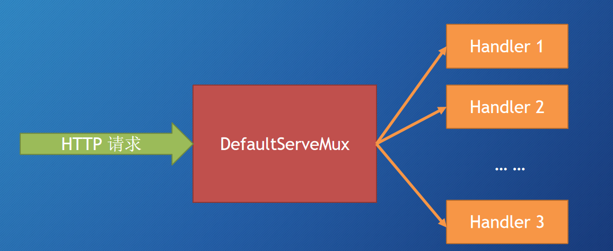
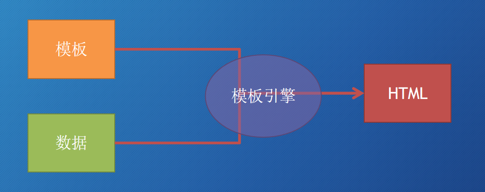
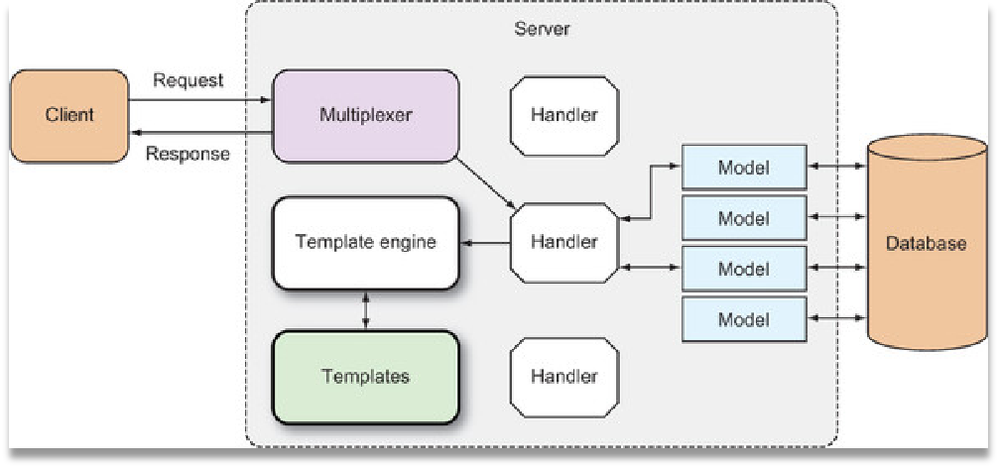
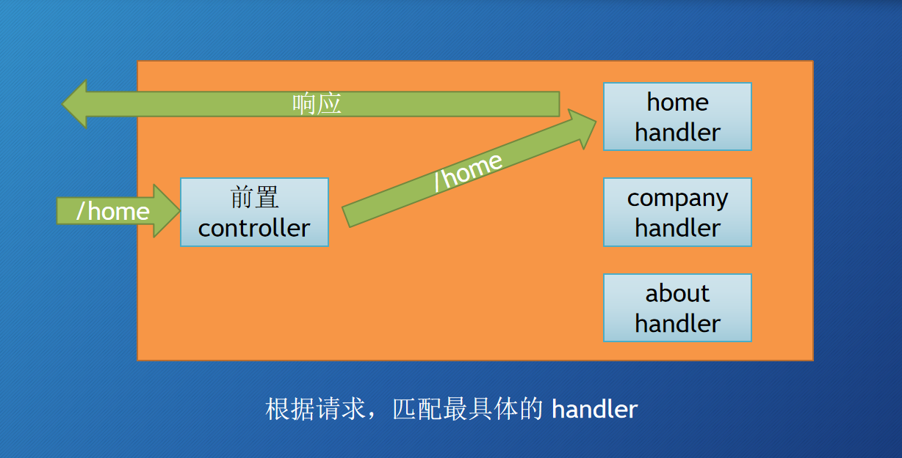
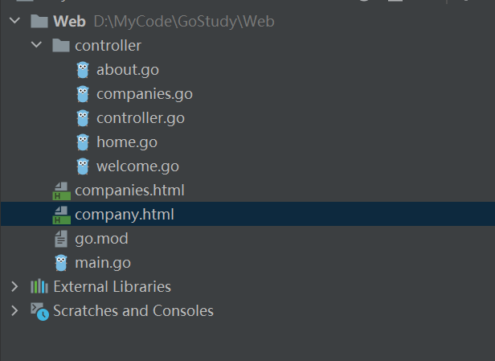
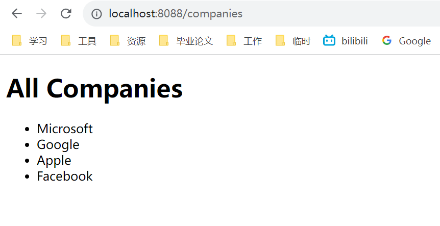
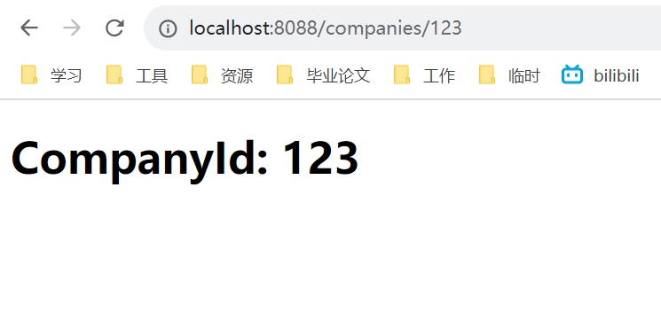
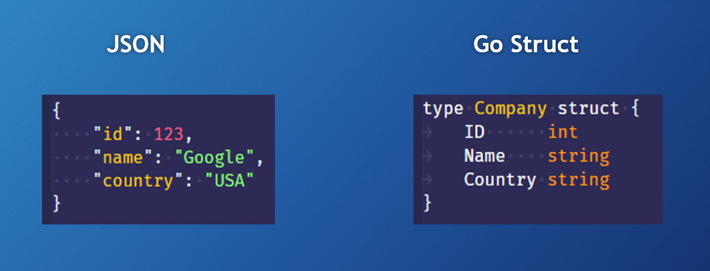
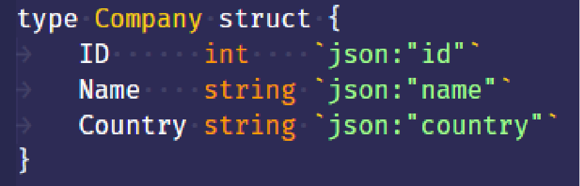
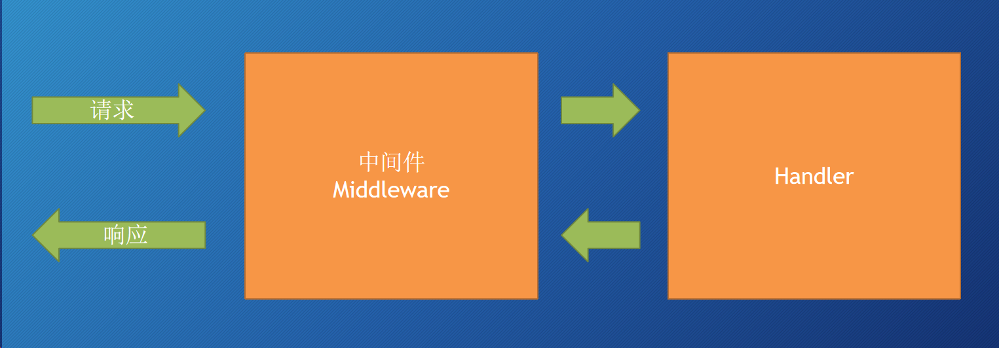

## 处理请求

### 创建 web server
```go
func main() {
	// 创建 web server
	// 方式一
    server := http.Server{
		Addr:    "localhost:8088",
		Handler: nil,
	}
	server.ListenAndServe()
    
	// 方式二，等同于上面的代码，上面的更灵活
	// http.ListenAndServe("localhost:8088", nil) 
}
```
> http.ListenAndServer()
> + 第一个参数是网络地址，如果为""，那么就是所有网络接口的 80 端口
> + 第二个参数是 handler，如果为 nil，那么就是 DefaultServeMux
>   + DefaultServeMux 是一个 multiplexer（可以看作是路由器）


> http.Server 这是一个 struct
> + Addr 字段表示网络地址，如果为""，那么就是所有网络接口的 80 端口
> + Handler 字段，如果为 nil，那么就是 DefaultServeMux
> + ListenAndServe() 函数

如果需要使用 https, 可以使用 `http.ListenAndServeTLS()` 和 `server.ListenAndServeTLS()`

### Handler
+ handler 是一个接口（interface）
+ handler 定义了一个方法 ServeHTTP()
+ HTTPResponseWriter，指向 Request 这个 struct 的指针

```go
type Handler interface {
	ServeHTTP(ResponseWriter, *Request)
}
```

### DefaultServeMux
它是一个 Multiplexer（多路复用器），同时也是一个 **Handler**



```go
// 源码
// DefaultServeMux is the default ServeMux used by Serve.
var DefaultServeMux = &defaultServeMux

var defaultServeMux ServeMux

type ServeMux struct {
	mu    sync.RWMutex
	m     map[string]muxEntry
	es    []muxEntry // slice of entries sorted from longest to shortest.
	hosts bool       // whether any patterns contain hostnames
}

// 实现了 Handler 接口中的 ServeHTTP 方法
func (mux *ServeMux) ServeHTTP(w ResponseWriter, r *Request) {
	if r.RequestURI == "*" {
		if r.ProtoAtLeast(1, 1) {
			w.Header().Set("Connection", "close")
		}
		w.WriteHeader(StatusBadRequest)
		return
	}
	h, _ := mux.Handler(r)
	h.ServeHTTP(w, r)
}
```

### 多个 Handler
http.Handle 函数
+ 不指定 Server struct 里面的 Handler 字段值，即为默认的 DefaultServeMux
+ 可以使用 http.Handle 将某个 Handler 附加到 DefaultServeMux
  + http 包有一个 Handle 函数
  + ServerMux struct 也有一个 Handle 方法
+ 如果你调用 http.Handle，实际上调用的是 DefaultServeMux 上的 Handle 方法
+ DefaultServeMux 就是 ServerMux 的指针变量

http.HandleFunc 函数

+ Go 有一个函数类型：HandlerFunc。可以将某个具有适当签名的函数 f，适配成为一个 Handler，而这个 Handler 具有方法 f
```go
type HandlerFunc func(ResponseWriter, *Request)

// 实现了 ServeHTTP 方法
func (f HandlerFunc) ServeHTTP(w ResponseWriter, r *Request) {
	f(w, r)
}
```

例子
```go
package main

import "net/http"

// 自定义 Handler
type helloHandler struct {
}

func (h *helloHandler) ServeHTTP(w http.ResponseWriter, r *http.Request) {
	w.Write([]byte("hello world"))
}

// 自定义 Handler
type aboutHandler struct {
}

func (a *aboutHandler) ServeHTTP(w http.ResponseWriter, r *http.Request) {
	w.Write([]byte("about"))
}

func welcome(w http.ResponseWriter, r *http.Request) {
	w.Write([]byte("welcome"))
}

func main() {
	h := helloHandler{}
	a := aboutHandler{}

	// 创建 web server
	server := http.Server{
		Addr:    "localhost:8088",
		Handler: nil,
	}
	server.ListenAndServe()

	http.Handle("/hello", &h)
	http.Handle("/about", &a)

	http.HandleFunc("/home", func(w http.ResponseWriter, r *http.Request) {
		w.Write([]byte("home"))
	})
	//http.HandleFunc("/welcome", welcome)
	http.Handle("/welcome", http.HandlerFunc(welcome))

}
```

### 内置 Handlers
+ http.NotFoundHandler
  + `func NotFoundHandler() Handler`
  + 返回一个 handler，它给每个请求的响应都是“404 page not found”
+ http.RedirectHandler
  + `func RedirectHandler(url string, code int) Handler`
  + 返回一个 handler，它把每个请求使用给定的状态码跳转到指定的 URL
  + url，要跳转到的 URL
  + code，跳转的状态码（3xx），常见的：StatusMovedPermanently、StatusFound 或 StatusSeeOther 等
+ http.StripPrefix
   + `func StripPrefix(prefix string, h handler) Handler`
   + 返回一个 handler，它从请求 URL 中去掉指定的前缀，然后再调用另一个 handler
     + 如果请求的 URL 与提供的前缀不符，那么 404
   + prefix，URL 将要被移除的字符串前缀
   + h，是一个 handler，在移除字符串前缀之后，这个 handler 将会接收到请求,修饰了另一个 Handler 
+ http.TimeoutHandler
  + `func TimeoutHandler(h Handler, dt time.Duration, msg string) Handler`
  + 返回一个 handler，它用来在指定时间内运行传入的 h
  + h，将要被修饰的 handler
  + dt，第一个 handler 允许的处理时间
  + msg，如果超时，那么就把 msg 返回给请求，表示响应时间过长
+ http.FileServer
  + `func FileServer(root FileSystem) Handler`
  + 返回一个 handler，使用基于 root 的文件系统来响应请求
  ```go 
  type FileSystem interface {
	Open(name string) (File, error)
  }
  ```

### 请求 Request
Reqeust（是个 struct），代表了客户端发送的 HTTP 请求消息

也可以通过 Request 的方法访问请求中的 Cookie、URL、User Agent 等信息

Request 即可代表发送到服务器的请求，又可代表客户端发出的请求
```go
type Request struct {

	Method string

	URL *url.URL

	Proto      string // "HTTP/1.0"
	ProtoMajor int    // 1
	ProtoMinor int    // 0

	Header Header

	Body io.ReadCloser

	GetBody func() (io.ReadCloser, error)

	ContentLength int64

	TransferEncoding []string

	Close bool

	Host string

	Form url.Values

	PostForm url.Values

	MultipartForm *multipart.Form

	Trailer Header

	RemoteAddr string

	RequestURI string

	TLS *tls.ConnectionState

	Cancel <-chan struct{}

	Response *Response

	ctx context.Context
}
```

## 模板
Web 模板就是预先设计好的 HTML 页面，它可以被模板引擎反复的使用，来产生 HTML 页面

Go 的标准库提供了 text/template，html/template 两个模板库，大多数 Go 的 Web 框架都使用这些库作为默认的模板引擎

模板引擎可以合并模板与上下文数据，产生最终的 HTML



### 工作原理

1. 在 Web 应用中，通产是由 handler 来触发模板引擎
2. handler 调用模板引擎，并将使用的模板传递给引擎，通常是一组模板文件和动态数据
3. 模板引擎生成 HTML，并将其写入到 ResponseWriter
4. ResponseWriter 再将它加入到 HTTP 响应中，返回给客户端

### 使用模板引擎
1. 解析模板源（可以是字符串或模板文件），从而创建一个解析好的 模板的 struct
2. 执行解析好的模板，并传入 ResponseWriter 和 数据，这会触发模板引擎组合解析好的模板和数据，来产生最终的 HTML，并将它传递给 ResponseWriter 

```go
func handleCompanies(w http.ResponseWriter, r *http.Request) {
	// 解析
	t, _ := template.ParseFiles("companies.html")
	// 执行
	t.Execute(w, nil)
}
```

### Action
Action 就是 Go 模板中嵌入的命令，位于两组花括号之间 
+ {{ xxx }}，就是一个 Action，而且是最重要的一个。它代表了传入模板的数据
+ Action 主要可以分为五类
  + 条件类
  + 迭代/遍历类
  + 设置类
  + 包含类
  + 定义类

## 路由


+ 静态路由：一个路径对应一个页面
+ 带参数的路由：根据路由参数，创建出一组不同的页面
+ 第三方路由
  + gorilla/mux：灵活性高、功能强大、性能相对差一些
  + httprouter：注重性能、功能简单
+ 自定义路由

```go
// main.go
package main

import (
	"Web/controller"
	"net/http"
)

func main() {
	server := http.Server{
		Addr: "localhost:8088",
	}
	controller.RegisterRoutes()

	server.ListenAndServe()
}

// companies.go
package controller

import (
	"net/http"
	"regexp"
	"strconv"
	"text/template"
)

func registerCompanyRoutes() {
	http.HandleFunc("/companies", handleCompanies)
	http.HandleFunc("/companies/", handleCompany)
}

func handleCompanies(w http.ResponseWriter, r *http.Request) {
	t, _ := template.ParseFiles("companies.html")
	t.Execute(w, nil)
}

func handleCompany(w http.ResponseWriter, r *http.Request) {
	t, _ := template.ParseFiles("company.html")

	pattern, _ := regexp.Compile(`/companies/(\d+)`)
	matches := pattern.FindStringSubmatch(r.URL.Path)
	if len(matches) > 0 {
		companyId, _ := strconv.Atoi(matches[1])
		t.Execute(w, companyId)
	} else {
		w.WriteHeader(http.StatusNotFound)
	}
}
```
目录结构


在浏览器地址栏输入：http://localhost:8088/companies



在浏览器地址栏输入：http://localhost:8088/companies



## JSON


因为Go中 struct 如果需要提供给其他地方使用，字段首字母需要大写，所以需要做一个映射



对于未知结构的 JSON
+ map[string]interface{} 可以存储任意 JSON 对象
+ []interface{} 可以存储任意的 JSON 数组

### 读取 JSON
+ 需要一个解码器：dec := json.NewDecoder(r.Body) 
  + 参数需实现 Reader 接口
+ 在解码器上进行解码：dec.Decode(&query)

### 写入 JSON
+ 需要一个编码器：enc := json.NewEncoder(w)
  + 参数需实现 Writer 接口
+ 编码：enc.Encode(results)

### Marshal 和 Unmarshal
Marshal（编码）: 把 go struct 转化为 json 格式，MarshalIndent，带缩进

Unmarshal（解码）: 把 json 转化为 go struct

区别：

针对 string 或 bytes：
+ Marshal => String
+ Unmarshal <= String

针对 stream：
+ Encode => Stream，把数据写入到 io.Writer
+ Decode <= Stream，从 io.Reader 读取数据


## 中间件


```go
type MyMiddleware struct {
	Next http.Handler
}

func(m *MyMiddleware) ServeHTTP(w http.ResponseWriter, r *http.Request) {
	// 指定下一个 handler
	if m.Next == nil {
		m.Next = http.DefaultServeMux/new(MyOtherHandler)
	}
	// 在 next handler 之前做一些事情
	m.Next.ServeHTTP(w, r)
	// 在 next handler 之后做一些事情
}
```

## 存储数据
[https://xiaoens.github.io/books/Go/go-mysql.html](https://xiaoens.github.io/books/Go/go-mysql.html)

