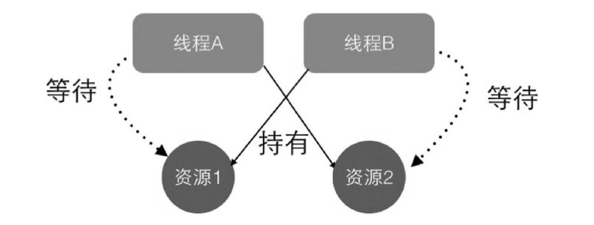

## 线程基础
+ 线程是进程中的一个实体，无法独立存在的
+ 进程是操作系统进行资源分配和调度的基本单位
+ 线程是CPU的最小执行单位

### 创建线程的方式
1. 继承Thread类
```java
public class ThreadTest {

    public static class ThreadTask extends Thread {
        @Override
        public void run() {
            System.out.println("I am a ThreadTask");
        }
    }

    public static void main(String[] args) {
        // 创建线程
        ThreadTask threadTask = new ThreadTask();
        // 启动线程
        threadTask.start();
    }

}
```
在调用 start 方法时，线程并没有立即执行，而是处于就绪状态，但抢到时间片的时候，才开始执行

并且 Java 是单继承的，如果继承了 Thread 类，就无法继承其他的类，并且 run() 方法是没有返回值的

2. 实现Runable接口
```java
public class ThreadTest {

    public static class RunnableTask implements Runnable {
        @Override
        public void run() {
            System.out.println("I am a RunnableTask");
        }
    }

    public static void main(String[] args) {
        RunnableTask runnableTask = new RunnableTask();
        // 创建线程并启动
        new Thread(runnableTask).start();
        new Thread(runnableTask).start();
    }

}
```
RunnableTask 是可以继承其他类的，但是有一个缺点，就是没有返回值

3. 实现Callable接口
```java
public class ThreadTest {

    public static class CallableTask implements Callable<String> {
        @Override
        public String call() throws Exception {
            return "I am a CallableTask";
        }
    }

    public static void main(String[] args) {
        // 创建异步任务
        FutureTask<String> futureTask = new FutureTask<>(new CallableTask());
        // 启动线程
        new Thread(futureTask).start();
        // 等待任务执行完毕，获取结果
        try {
            String result = futureTask.get();
            System.out.println(result);
        } catch (InterruptedException e) {
            e.printStackTrace();
        } catch (ExecutionException e) {
            e.printStackTrace();
        }

    }

}
```
可以继承其他类，并且可以获取返回值

### wait，notify，sleep，join，yield
+ Thread.wait(): 当前线程被挂起，并释放锁，处于阻塞状态，
+ Thread.notify()：唤醒一个在该共享变量上调用 wait() 方法的线程
+ Threed.sleep()：当前线程被挂起，但是不释放锁，处于阻塞状态
+ Thread.join(): 等待线程执行完毕，再执行后继操作
+ Thread.yield(): 让出当前线程的时间片，然后处于就绪状态

### 死锁
死锁是两个及两个以上的线程在执行过程中，因争夺资源而产生相互等待的现象，并且在无外力的作用下，这种现象会一直持续下去



产生死锁的必要条件
+ 互斥条件：一个资源只能被一个线程持有
+ 保持并请求：线程持有当前资源，并去请求其他资源
+ 不可剥夺：线程获取到的资源不能被其他线程强制剥夺
+ 环路等待：在发生死锁时，必然会有一个线程-资源的环行链

如何避免产生死锁
+ 破坏环路等待，对资源的申请保持有序性

