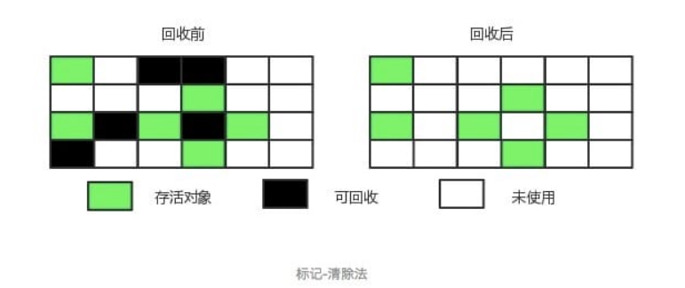
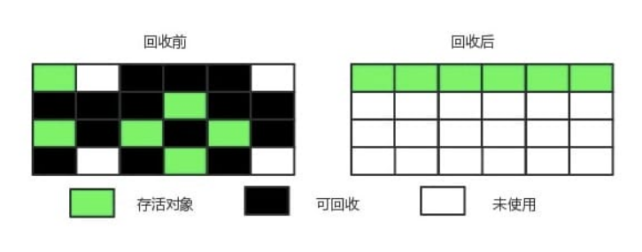
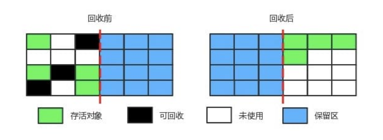

## 虚拟机栈

### 栈桢

### 局部变量表

### 操作数栈

## 垃圾回收

### 垃圾判断

### 引用类型

### 垃圾回收算法
**标记-清除算法**：将存活的对象进行标记，然后清理掉未被标记的对象。

不足：
+ 标记和清除过程效率都不高
+ 会产生大量不连续的内存碎片，导致无法给大对象分配内存

**标记-整理算法**：让所有存活的对象都向一端移动，然后直接清理掉端边界以外的内存

**复制算法**：将内存划分为大小相等的两块，每次只使用其中一块，当这一块内存用完了就将还存活的对象复制到另一块上面，然后再把使用过的内存空间进行一次清理

不足：只使用了内存的一半

> 现在的商业虚拟机都采用这种收集算法来回收新生代，但是并不是将新生代划分为大小相等的两块，而是分为一块较大的 Eden 空间和两块较小的 Survivor 空间，每次使用 Eden 空间和其中一块 Survivor。在回收时，将 Eden 和 Survivor 中还存活着的对象一次性复制到另一块 Survivor 空间上，最后清理 Eden 和使用过的那一块 Survivor。
>
>HotSpot 虚拟机的 Eden 和 Survivor 的大小比例默认为 8:1，保证了内存的利用率达到 90%。
> 
>如果每次回收有多于 10% 的对象存活，一块 Survivor 空间就不够用了，此时需要依赖于老年代进行分配担保，也就是借用老年代的空间存储放不下的对象。

**分代搜集算法**
现在的商业虚拟机采用分代收集算法，它根据对象存活周期将内存划分为几块，不同块采用适当的收集算法。

一般将堆分为新生代和老年代。
+ 新生代使用: 复制算法
+ 老年代使用: 标记-清除 或者 标记-整理算法

