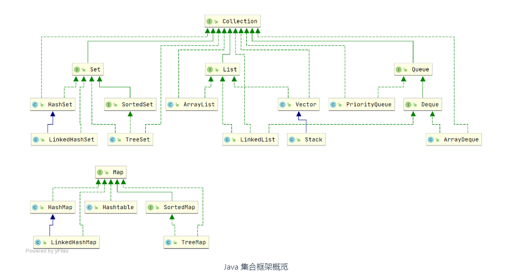
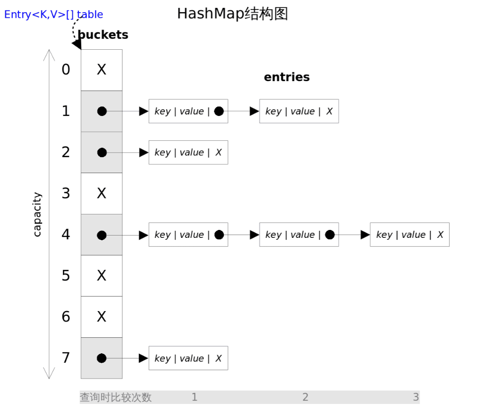
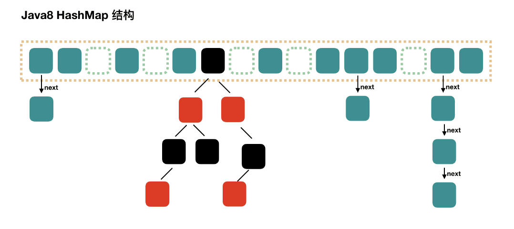

## 集合


+ List：存储的元素是有序，可重复的，可存放多个null
+ Set：存储的元素是无序，不可重复的，只能存放一个null
+ Queue：按特定的规则处理元素（先入先出，先入后出），存储的元素是有序，可重复的，可存放多个null

### ArrayList
```java
public class ArrayList<E> extends AbstractList<E>
        implements List<E>, RandomAccess, Cloneable, java.io.Serializable
{
	// 默认初始容量大小
    private static final int DEFAULT_CAPACITY = 10;
	// 空数组,用于空实例,创建一个size为0的List, List<Integer> list = new ArrayLislt<>(0)
    private static final Object[] EMPTY_ELEMENTDATA = {};
	// 用于默认大小空实例的共享空数组实例
    // 即创建的时候不指定空间大小，在第一次add的时候创建初始容量为10的Object数组
    private static final Object[] DEFAULTCAPACITY_EMPTY_ELEMENTDATA = {};
	// 保存ArrayList数据的数组
    transient Object[] elementData; // non-private to simplify nested class access
	// ArrayList中包含的元素个数
    private int size;
}
```
ArrayList的扩容机制: 
+ ArrayList的默认容量为10
+ 创建的时候是调用无参的构造方法，此时的数组容量为0
+ 当第一次添加元素时，会进行扩容，将容量设置为10
+ 如果不足够，会进行扩容操作，扩容后的数组容量是原数组的1.5倍

## Map

### HashMap
Java7 HashMap

实现结构：数组 + 链表

哈希冲突解决：冲突链表法（头插法）



Java8 HashMap

实现结构：数组 + 链表 + 红黑树

哈希冲突解决：
+ 冲突链表法（尾插法）
+ 红黑树：当链表长度超过8时，会将链表转换为红黑树
  + 注意：转换前会做一个判断，如果当前数组长度小于64，会选择进行数组扩容，反之会进行转换



### HashSet
HashSet是对HashMap的简单包装，对HashSet的调用都会转换为合适的HashMap方法
```java
package java.util;
// ..........
public class HashSet<E>
    extends AbstractSet<E>
    implements Set<E>, Cloneable, java.io.Serializable
{
    static final long serialVersionUID = -5024744406713321676L;

    private transient HashMap<E,Object> map;

    private static final Object PRESENT = new Object();
    
    public HashSet() {
        map = new HashMap<>();
    }

    public Iterator<E> iterator() {
        return map.keySet().iterator();
    }

    public int size() {
        return map.size();
    }

    public boolean isEmpty() {
        return map.isEmpty();
    }

    public boolean contains(Object o) {
        return map.containsKey(o);
    }

    public boolean add(E e) {
        return map.put(e, PRESENT)==null;
    }
    
    public boolean remove(Object o) {
        return map.remove(o)==PRESENT;
    }

    public void clear() {
        map.clear();
    }
	
	// ...................
}

```

## 反射
作用：在运行时分析类以及执行类中方法的能力

优点：使代码更加灵活

缺点：在运行时分析操作类的能力，增加的安全问题；并且反射的性能也差一些

```java
// Main.java
import sun.reflect.Reflection;

import java.lang.reflect.*;

public class Main {

    public static void main(String[] args) throws IllegalAccessException, InstantiationException, NoSuchMethodException, InvocationTargetException {

        // 获取 Class 对象
        Class targetClass = getClassMethod1();
        // 创建实例对象
        TargetObject to = (TargetObject) targetClass.newInstance();

        // 获取构造方法
        Constructor constructor = targetClass.getConstructor(null);
        TargetObject to2 = (TargetObject)constructor.newInstance();

        // 获取属性
        System.out.println("----------------------------------");
        Field[] fields = targetClass.getDeclaredFields();
        for (Field field : fields) {
            if (Modifier.isPrivate(field.getModifiers())) {
                field.setAccessible(true); // 私有方法或者属性需要设置为true，取消安全检查
            }
            System.out.println(field.getName());
        }

        // 获取方法
        System.out.println("----------------------------------");
        Method[] declaredMethods = targetClass.getDeclaredMethods();
        for (Method method : declaredMethods) {
            if (Modifier.isPrivate(method.getModifiers())) {
                method.setAccessible(true); // 取消安全检查
            }
            method.invoke(to);
        }
    }

    // 获取 Class 的四种方式
    // 知道具体的类
    public static Class getClassMethod1() {
        return TargetObject.class;
    }

    // 通过 Class.forName() 并传入全限定类名
    public static Class getClassMethod2() {
        try {
            return Class.forName("com.xiao.reflection.TargetObjec");
        } catch (ClassNotFoundException e) {
            e.printStackTrace();
        }
        return null;
    }

    // 通过实例对象获取
    public static Class getClassMethod3() {
        TargetObject to = new TargetObject();
        return to.getClass();
    }

    // 通过类加载器获取
    public static Class getClassMethod4() {
        try {
            return ClassLoader.getSystemClassLoader().loadClass("com.xiao.reflection.TargetObject");
        } catch (ClassNotFoundException e) {
            e.printStackTrace();
        }
        return null;
    }
}

// TargetObject.java
public class TargetObject {

    private String value;

    public TargetObject() {
        value = "this is TargetObject";
    }

    public void printInfo1() {
        System.out.println("this is public method");
    }

    private void printInfo2() {
        System.out.println("this is private method");
    }

    protected void printInfo3() {
        System.out.println("this is protected method");
    }
}
```
运行结果
```text
----------------------------------
value
----------------------------------
this is protected method
this is public method
this is private method
```