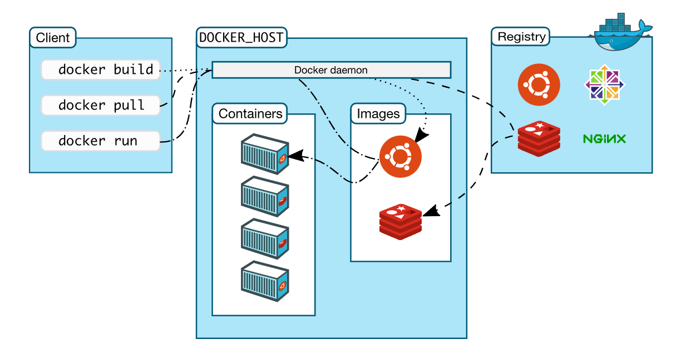
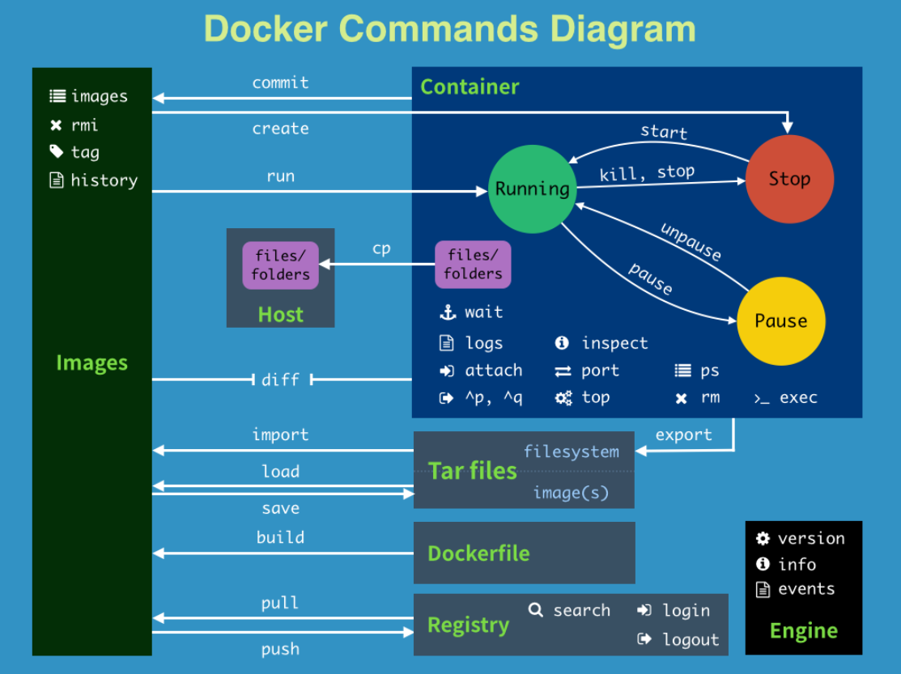

## 安装 & 启动 & 使用（Ubuntu 22.04）
卸载旧版本: `sudo apt-get remove docker docker-engine docker.io containerd`

安装 docker : `sudo apt-get install docker-ce docker-ce-cli containerd.io docker-compose-plugin`

启动 docker ：`sudo systemctl enable docker`

运行 hello-world ：`sudo docker run hello-world`

注意：需要配置镜像加速，提升拉取镜像的速度

## 常用命令
1. 启动：`systemctl start docker`
2. 停止：`systemctl stop docker`
3. 重启：`systemctl restart docker`
4. 查看状态：`systemctl status docker`
5. 查看 docker 版本：`docker version`
6. 查看 docker 信息：`docker info`
7. 列出本机镜像：`docker images`
8. 下载镜像：`docker pull 镜像名称[:版本号]`
9. 删除镜像：`docker rmi 镜像名称/ID`

## 容器


**启动容器**: `docker run [OPTIONS] IMAGE [COMMAND] [ARG...]`
+ --name：为容器指定一个名称
+ -d：后台运行容器并返回容器ID，也即启动守护式容器
+ -e：为容器添加环境变量
+ -P：随机端口映射。将容器内暴露的所有端口映射到宿主机随机端口
+ -p：指定端口映射
  + -p hostPort:containerPort：端口映射，例如-p 8080:80
  + -p ip:hostPort:containerPort：配置监听地址，例如 -p 10.0.0.1:8080:80
  + -p ip::containerPort：随机分配端口，例如 -p 10.0.0.1::80
  + -p hostPort1:containerPort1 -p hostPort2:containerPort2：指定多个端口映射，例如-p 8080:80 -p 8888:3306


**列出正在运行的容器**: `docker ps [OPTIONS]`
+ -a：列出当前所有正在运行的容器+历史上运行过的容器
+ -l：显示最近创建的容器
+ -n：显示最近n个创建的容器
+ -q：静默模式，只显示容器编号

**启动已经停止的容器**: `docker start 容器ID或容器名`

**重启容器**:`docker restart 容器ID或容器名`

**停止容器**: `docker stop 容器ID或容器名`

**强制停止容器**: `docker kill 容器ID或容器名`

**删除容器**: `docker rm 容器ID或容器名`  强制删除: `docker rm -f 容器ID或容器名`

**查看容器日志**：`docker logs 容器ID或容器名`

**查看容器内运行的进程**：`docker top 容器ID或容器名`

**查看容器内部细节**: `docker inspect 容器ID或容器名`

**进入正在运行的容器**: + `docker exec -it 容器ID bashShell`  

**重新进入**: `docker attach 容器ID`

**文件拷贝**:
+ 容器内文件拷贝到宿主机：`docker cp 容器ID:容器内路径 目的主机路径` 
+ 宿主机文件拷贝到容器中: `docker cp 主机路径 容器ID:容器内路径` 

**导入和导出容器**
+ export：导出容器的内容流作为一个tar归档文件（对应import命令）；
+ import：从tar包中的内容创建一个新的文件系统再导入为镜像（对应export命令）；

```shell
# 导出
# docker export 容器ID > tar文件名
docker export abc > aaa.tar

# 导入
# cat tar文件 | docker import - 自定义镜像用户/自定义镜像名:自定义镜像版本号
cat aaa.tar | docker import - test/mytest:1.0.1
```

**将容器生成新镜像**: `docker commit -m="提交的描述信息" -a="作者" 容器ID 要创建的目标镜像名:[tag]`


## 镜像

## Dockerfile